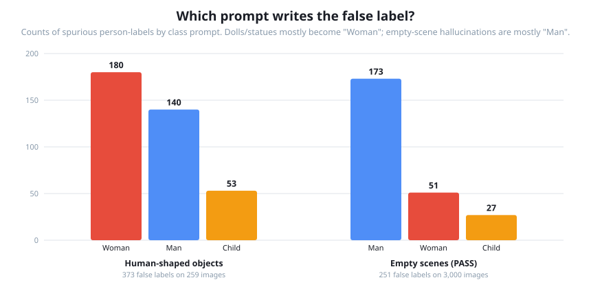
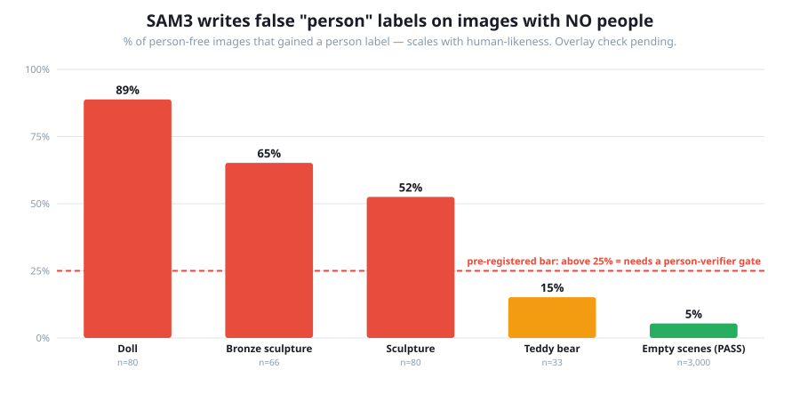
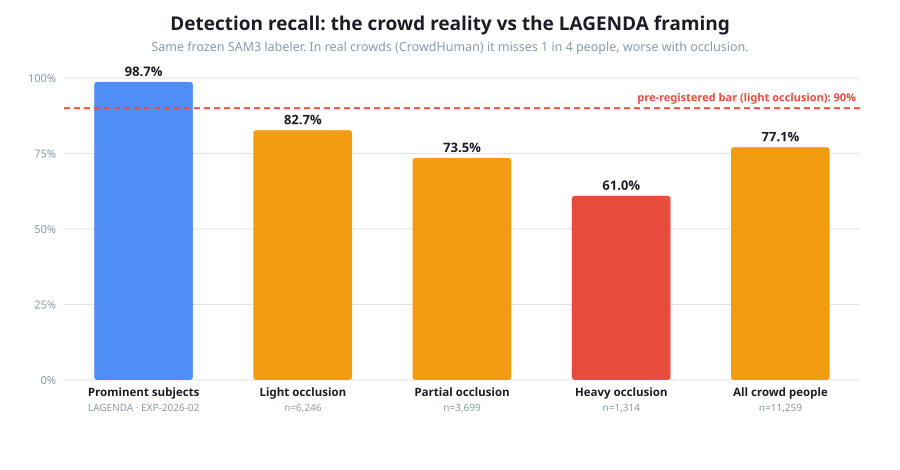

# Experiment: Does the SAM3 auto-labeler invent people, and can it handle crowds?

**In one line:** part 2 of the SAM3 auto-labeler audit — we point the production labeler at the two
things LAGENDA couldn't test (images with *no* people, and crowds where *every* person is labeled)
to measure false positives and detection precision, scored **separately on each dataset**.

**Status:** Run complete (2026-07-13) — all three datasets scored; overlay adjudications pending ·
PASS 3,000 / objects 259 / CrowdHuman 500-image sample (11,259 persons) · Owner: Mostafa

---

# 1 · Executive summary

### Bottom line

EXP-2026-02 concluded that detection was the labeler's solved job. This experiment shows that was
LAGENDA's framing, not SAM's reality. Measured on data LAGENDA couldn't provide, SAM3's detection
breaks on **both** sides:

- **It invents people on human-shaped objects — badly.** 62% of verified person-free
  doll/statue/toy images gained at least one person label; on doll images it's 89%, averaging
  2.3 spurious labels per image, most often as "Woman." The failure scales cleanly with
  human-likeness (dolls 89% → bronze statues 65% → sculptures 53% → teddy bears 15%): SAM matches human *form* and nothing in the pipeline asks whether it's a real person. The team's
  toy/mannequin observation is confirmed as default behavior, not a glitch.
- **Even genuinely empty scenes aren't safe.** 1 in 18 person-free PASS images (5.4%) gains a
  person label — mostly "Man." A real baseline, though an order of magnitude milder than the
  human-shaped-object case.
- **In real crowds, it silently misses 1 in 4 people.** Recall is 77% overall and degrades with
  occlusion (83% lightly occluded — below our 90% bar — down to 61% heavily occluded). Every
  miss becomes a person the trained model learns to treat as background.
- **One good surprise: fragmentation is rare (1.1% duplicates), and precision is decent
  (86.6%).** This also largely settles EXP-2026-02's open "56% of images look crowded" puzzle:
  the excess detections there were most likely real unlabeled people, not SAM splitting one
  person into many boxes.

**What we'd do about it:** the replacement pipeline needs a **person-verifier gate** (a step that
asks "is this a real person?" — SAM3 alone cannot), and crowd-heavy scrape sources need either
better recall or exclusion. The current filename-based "negative" guard protects nothing in
ordinary images that contain dolls or statues.

### Scorecard (bars set before running — results filled after)

| Dataset                        | Metric                                                  | Bar (pre-registered)                                | Result                                                                            |
| ------------------------------ | ------------------------------------------------------- | --------------------------------------------------- | --------------------------------------------------------------------------------- |
| PASS                           | false positives per 100 empty images                    | < 2 negligible · > 10 real problem                 | **8.4** ⚠️ in-between — 5.4% of images affected, ~1.5 FPs each when it happens |
| Open Images toys/statues/dolls | % of human-shaped-object images that get a person label | > 25% = confirms a real FP source needing a gate    | **62.2%** ❌ — dolls 88.8%, 2.3 FPs/image; Woman is the top spurious class |
| CrowdHuman                     | detection precision (boxes hitting a real person)       | ≥ 85% good · < 70% = over-detection is real noise | **86.6%** ✅ (lower bound, poster check pending)                            |
| CrowdHuman                     | recall on lightly-occluded people                       | ≥ 90%                                              | **82.7%** ❌ — overall 77.1%, heavy occlusion 61.0%                        |
| CrowdHuman                     | duplicates per matched person (one person, many boxes)  | < 5%                                                | **1.1%** ✅ — fragmentation is rare                                        |

**Scope:** this is a **detection experiment** — false positives and precision. It does not touch
classification accuracy, gender, or age (those were EXP-2026-02 / EXP-2026-01, and CrowdHuman has
no age/gender labels anyway). Numbers are reported **per dataset, never pooled** — each dataset
answers a different question and mixing them would hide which is which.

---

# 2 · Plan and results

## 2.1 Context

EXP-2026-02 measured how well SAM handles *real, labeled people* and found detection recall of
98.7% and an age-axis classification problem. But every number there was **label-anchored**: it
only graded boxes that landed on a person LAGENDA had labeled. Two things stayed invisible:

- **False positives** — labels SAM writes where there's no person (the team has seen it fire on
  toys and mannequins). LAGENDA can't show this: every image has a person.
- **Detection precision and duplicates in crowds** — on LAGENDA an unmatched SAM box could always
  be a real but unlabeled person, so we could never call it a mistake. That left the "56% of
  images have 3+ more detections than labeled people" finding unresolved.

This experiment brings in data built exactly for those two questions, and scores each on its own.

## 2.2 The "person" ruling (pre-registered — this decides what counts as a false positive)

Per the product owner: **a "person" is anything a viewer is meant to lower their gaze from in the
Islamic sense — including a printed or photographic *depiction* of a real person** (a poster,
billboard, magazine cover, photo-on-packaging). So:

- **Counts as a person (SAM firing on it is CORRECT, not a false positive):** a real human; a
  photo/poster/printed image of a real human.
- **Does NOT count as a person (SAM firing on it IS a false positive):** a mannequin, doll, toy,
  statue, or sculpture — a human-*shaped* object that is not a depiction of a specific real person.

**Why this matters for the datasets:**

- It means the toy/mannequin set must be **hand-built to exclude any image that also contains a
  printed photo/poster of a real person** — otherwise SAM firing there would be correct and we'd
  wrongly score it as an FP.
- It means some CrowdHuman "false positives" may actually be SAM correctly boxing a person on a
  poster/billboard in the scene that CrowdHuman didn't annotate — so CrowdHuman precision is a
  *lower bound*, and we hand-check a sample of its unmatched detections to separate "poster/statue
  of a person" from genuine hallucination (§2.6).

**Open judgment call flagged for confirmation:** a hyper-realistic mannequin is genuinely
borderline. We pre-register it as *not* a person (FP) for this run, matching the team's original
"mannequins are noise" observation, but the owner should confirm.

## 2.3 Objective & success bars

Question, per dataset: **how often does SAM invent a person (PASS, toys/mannequins), and in a real
crowd how clean and complete are its detections (CrowdHuman)?** Bars pre-registered in the §1
scorecard, before any run. The bars encode the action each result triggers — e.g. a high mannequin
FP rate means the replacement pipeline needs a confidence gate or a person-verifier step, since the
Stage-0 redesign keeps SAM as the detector and would not fix this on its own.

## 2.4 Datasets, and why each is trustworthy (label quality vetted 2026-07-13, web-verified)

The whole experiment depends on trusting each dataset's labels *for its specific job*. For a
false-positive test that means **exhaustive** annotation — you must trust that "no person label"
means "no person." That requirement drove the choices, and ruled two popular datasets out.

- **PASS** (~1.44M images, Oxford VGG) — for empty scenes. Purpose-built to contain no humans:
  filtered with RetinaFace + Cascade-RCNN *and* human verification, then cleaned again across
  versions (v2 removed 472 stragglers, v3 another 131). About as trustworthy as "person-free"
  gets. Unlabeled (no object classes), which is fine — on PASS *any* SAM person-label is the FP.
- **CrowdHuman val** (4,370 images, ~23 people/image) — for crowds. Exhaustively annotated,
  **double-checked by different annotators**, every person carries head + visible-region +
  full-body boxes across mild-to-severe occlusion. The standard benchmark for exactly the
  "is an unmatched box a real person or a duplicate" question. We use the **visible-region** box
  (pairs better with SAM's masks than full-body). No age/gender → detection-only.
  **Subsampled to a random 500 images (seed 51)** — the crowd-heavy images run SAM3 at ~6 s/image
  (7 h for the full set), and 500 images is already ~11,500 GT persons / ~10,000 detections, so
  the precision/recall CIs are <±1%; the full set adds nothing statistically. Settings are
  unchanged — only the image count is reduced.
- **Open Images subset, hand-verified** (~100–200 images) — for the human-shaped-object risk
  (toys/dolls/mannequins/statues). Sourced by filtering Open Images to `Doll` / `Teddy bear` /
  `Sculpture` (+ any mannequin-like class), then **hand-checked** per the §2.2 ruling: confirm no
  real person and no photo/poster of one. We hand-verify because Open Images is **non-exhaustive**
  (its person labels can't be trusted as complete) and because no public benchmark of human-shaped
  non-people exists. Small-but-verified beats large-but-noisy here.

**Rejected — and why:** **Open Images** and **COCO** as *negative* sources (i.e. "images with no
person"). Both are **non-exhaustive**: absence of a person label does not mean absence of a person
(Google itself warns Open Images person evaluations can be "potentially misleading"; COCO has
documented missing person annotations, including foreground people). A false-positive test scored
against non-exhaustive labels would flag real unlabeled people as FPs. We only use Open Images for
the *hand-verified* object subset above, where we check each image ourselves. Sources in Appendix.

## 2.5 Method

Same two-stage shape as EXP-2026-02 (production code runs untouched), run **once per dataset**:

1. **Stage A (pod, GPU):** run the production `autolabel_sam.py` **unchanged** (frozen settings:
   prompts `"woman" "man" "child"`, conf 0.4, nms_iou 0.7) over each dataset's images. **Trap:**
   the labeler skips any path containing the string `"negative"` — the negatives folders must
   **not** be named `negatives/` or Stage A silently processes zero images.
2. **Stage B (CPU):** `run_autolabel_on_manifest.py`, extended with two modes:
   - **Negatives mode** (PASS, toys/mannequins): no ground-truth boxes. Every SAM detection is a
     false positive. Report FP count per image, % of images with ≥1 FP, and which prompt fired
     (woman/man/child). On the toy set, attribute each FP to the object type (doll/mannequin/…).
   - **Crowd mode** (CrowdHuman): exhaustive GT. Reuse `match_boxes`/`iou` unchanged, add
     precision (matched detections ÷ all detections), recall stratified by occlusion (from the
     CrowdHuman visible/full-body ratio), and duplicates-per-GT (how many SAM boxes hit one
     person — the fragmentation metric).
3. **Proof:** the `build_error_gallery.py` gallery, per dataset — FP montages (what did SAM fire
   on?), and for CrowdHuman, unmatched-detection and duplicate montages, plus the hand-checked
   sample separating poster/statue "FPs" from genuine hallucination.

## 2.6 Results — per dataset

_Pending. Each dataset gets its own subsection, its own metric table, and its own gallery — no
pooling. Filled after the run._

### 2.6.1 PASS (empty scenes) — hallucination baseline

**Run 2026-07-13:** 3,000 person-free images (streamed sample of PASS.0.tar) · **251 false
person-labels** · **8.37 per 100 images** · **5.4% of images affected** (CI 4.7–6.3%); when it
fires, ~1.5 labels per affected image.



| Prompt | Spurious labels |
| ------ | --------------- |
| Man    | 173 (69%)       |
| Woman  | 51              |
| Child  | 27              |

Against the pre-registered bar (<2 negligible · >10 real problem): **in between — a real,
non-negligible baseline, not a crisis.** Roughly 1 in 18 genuinely person-free images still
gains a person label. Note the class flip vs the object set: on empty scenes the dominant
spurious class is *Man*, on dolls/statues it was *Woman*. What the "man" prompt fires on in
empty scenes is answered by the overlay montage (100 written) — _adjudication pending_.

Put together with §2.6.2, the false-positive picture has a clear shape: **5.4% of empty scenes →
62.2% of human-shaped-object images (88.8% of doll images).** SAM3's false positives are not
random hallucination; they concentrate ~11× on human-like forms.

### 2.6.2 Open Images toys/statues/dolls — human-shaped-object false positives

**Run 2026-07-13:** 259 hand-verified person-free images · **373 false person-labels** ·
**62.2% of images got at least one** (CI 56.1–67.9%) — far past the pre-registered 25% bar.



| Object type      | Images | Images with ≥1 FP | Total FPs           |
| ---------------- | ------ | ------------------ | ------------------- |
| Doll             | 80     | **88.8%**    | 181 (2.3 per image) |
| Bronze sculpture | 66     | 65.2%              | 73                  |
| Sculpture        | 80     | 52.5%              | 108                 |
| Teddy bear       | 33     | 15.2%              | 11                  |

By prompt: **Woman 180 · Man 140 · Child 53** — dolls and statues most often enter the training
data as "woman" labels.

Two readings:

- **The failure scales with human-likeness** (dolls 89% → bronze 65% → sculpture 53% → teddy
  15%). SAM3's class prompts match *human form*; nothing in the pipeline asks "is this a real
  person?" This confirms and quantifies the team's original toy/mannequin observation — it is
  not an occasional glitch, it is the default behavior on human-shaped objects.
- **Production impact:** any scraped image containing dolls, statues, or display figures injects
  ~1–2 wrong person-labels. The only current guard is the `"negative"`-in-filename check, which
  does nothing for ordinary images that happen to contain these objects. A person-verifier gate
  (or negatives-aware filtering) in the replacement pipeline is now justified by measurement,
  not anecdote.

_Pending:_ full-res overlay adjudication (161 annotated images) — any FP that is actually a real
person or printed depiction missed at thumbnail review gets excluded per the §2.2 ruling. The
counts above are prior to that final pass.

### 2.6.3 CrowdHuman — crowd precision, occlusion recall, duplicates

**Run 2026-07-13:** 500-image seed-51 sample · 11,259 GT persons · 12,667 SAM detections
(2,644 excluded by ignore regions, 10,023 scored).



| Metric                        | Result                                         | Bar    | Verdict                                               |
| ----------------------------- | ---------------------------------------------- | ------ | ----------------------------------------------------- |
| Detection precision           | **86.6%** (8,683/10,023, CI 86.0–87.3%) | ≥ 85% | ✅ passes — but read as a*lower bound* (see below) |
| Recall, light occlusion       | **82.7%** (5,164/6,246)                  | ≥ 90% | ❌**fails**                                     |
| Recall, partial occlusion     | **73.5%** (2,717/3,699)                  | —     |                                                       |
| Recall, heavy occlusion       | **61.0%** (802/1,314)                    | —     |                                                       |
| Recall, overall               | **77.1%** (8,683/11,259)                 | —     |                                                       |
| Duplicates per matched person | **1.1%** (99/8,683)                      | < 5%   | ✅ passes                                             |

Three readings:

- **The headline: SAM silently misses people in crowds.** Nearly 1 in 4 real people go unlabeled
  (77.1% recall), and it degrades with occlusion exactly as you'd expect (82.7% → 73.5% → 61.0%).
  This is the number LAGENDA structurally couldn't show: its 98.7% recall was measured on
  prominent, curated subjects. In real crowded scenes even *lightly-occluded* people are missed
  ~17% of the time — each one a person the downstream model is taught to treat as background.
- **Fragmentation is rare — which largely answers EXP-2026-02's open "56% crowded" puzzle.** At
  1.1% duplicates, SAM does not habitually split one person into many boxes. The excess
  detections over LAGENDA's sparse labels were therefore most likely *real unlabeled people*
  (supporting evidence from a different dataset, not proof on LAGENDA itself).
- **Precision is a lower bound pending the hand-check.** 1,340 detections went unmatched:
  99 duplicates, 1,061 partial-overlap (IoU 0.1–0.5 with some person — plausibly real people
  with imperfect boxes), and 180 clear FPs (0.36/image). Per the §2.2 ruling some clear FPs may
  be posters/statues of people (correct detections CrowdHuman doesn't annotate) — the Phase-4
  overlay tally (real person / poster-or-statue / genuine hallucination) is _pending_.

## 2.7 Limitations (pre-registered)

- **Detection only.** No classification/gender/age here (CrowdHuman has no such labels). This
  completes the *detection* column of the component table; gender still needs the Gulf-dress
  slice, age still needs MiVOLO.
- **Domain mismatch.** PASS, CrowdHuman and Open Images are general Western-ish photos, not the
  scraped imagery production runs on — same caveat as LAGENDA.
- **The mannequin ruling is a judgment call** (§2.2); a different ruling changes the toy-set FP
  count directly.
- **CrowdHuman precision is a lower bound** under our "posters count as people" ruling — the
  hand-checked sample (§2.6.3) quantifies how much.
- **Box overlap in crowds makes individual matches ambiguous — but it cannot have manufactured
  the headline findings.** GT boxes routinely overlap each other in CrowdHuman, so a detection
  can be credited to the wrong neighbor. Because matching is mutually exclusive and the metrics
  are pure counts, identity swaps between neighbors don't change recall/precision at all. The
  two real distortions push in known directions: a merged box spanning two people counts one
  found + one missed (correct semantics for labeling — one person truly got no label), and a
  sloppy box accidentally crediting a neighbor *inflates* recall — so the true miss rate is, if
  anything, **worse** than the reported 77%, and the failed 90% bar fails regardless. Precision
  is deflated by real-people-in-the-partial-bucket, hence "lower bound." Unquantified checks
  that would firm this up: a merged-detection count (SAM boxes overlapping ≥2 GT persons at
  ≥0.5) and a match-IoU sweep (0.4/0.5/0.6) — both cheap CPU re-analyses; and the pending 60
  overlay images are the direct visual audit.
- **The toy/mannequin set is small (~100–200 images)** — wide confidence intervals; it tells us
  *whether* the failure mode is real and roughly how big, not a precise rate.

## 2.8 Next steps

- **Finish the two overlay adjudications (the only remaining human step):**
  objects overlays (161 images — confirm FPs sit on objects, not missed real people/posters) and
  crowd overlays (60 images — tally clear-FPs into real person / poster-or-statue / genuine
  hallucination). PASS overlays (100) are worth a skim too: what does the "man" prompt fire on
  in empty scenes?
- **Add a person-verifier gate to the Stage-0 replacement design.** The 62% object-FP rate is
  now the measured justification: SAM3 detects human *form*; a second component must decide
  "real person?" before a label is written. (The Stage 2 ensemble — VLM + MiVOLO — can play this
  role for free: a face/body age-gender model abstaining on a doll is itself a strong
  not-a-person signal.)
- **Treat crowd recall as an open detection problem** (77% overall, 61% heavy occlusion) — either
  improve it (different prompting, lower conf + verifier) or constrain scrape sources away from
  dense-crowd imagery where 1-in-4 people become background noise.
- **Update the component table** (EXP-2026-02 §2.6 / CLAUDE.md): detection is NOT "settled except
  precision" — recall is only settled for prominent subjects; crowds and human-shaped objects
  both break it.
- **Then EXP-2026-04 (MiVOLO age component)** as planned — datasets under `/workspace/datasets/`
  are staged for reuse.

---

# 3 · Appendices

## Appendix A — datasets, access, and label-quality sources

- **PASS** — https://www.robots.ox.ac.uk/~vgg/data/pass/ · paper: arXiv 2109.13228. CC-BY,
  person-free by construction (face/human-detector filtered + human-verified + version cleanup).
- **CrowdHuman** — paper: arXiv 1805.00123 · exhaustively annotated, annotator double-check, head
  + visible + full-body boxes, ~23 people/image, 4,370 val. Use visible-region boxes.
- **Open Images V7** — non-exhaustive by design (image-level positive/negative labels; only
  positive categories boxed); Google's own docs flag person/fairness evals as potentially
  misleading. Used here ONLY as a source for the hand-verified object subset.
- **COCO** — documented missing person annotations (background and some foreground). Rejected as
  a negatives source for the same non-exhaustiveness reason.

_(Full source links recorded in the session that created this doc; the load-bearing facts: Open
Images + COCO are non-exhaustive → unusable as "no-person" ground truth; CrowdHuman is exhaustive
and double-checked; PASS is purpose-built person-free.)_

- **Charts:** `experiments/make_charts_exp03.py` → `experiments/assets/sam_fp_*.svg` +
  `sam_crowd_recall_by_occlusion.svg`; 2× PNGs for ClickUp in
  `experiments/assets/png/EXP-2026-03/` (Chrome headless, `--force-device-scale-factor=2`).
- **Run outputs on the pod:** `/workspace/exp03/eval/{pass,objects,crowd}/` — each has
  `summary.json`, per-image jsonl, and `overlays/` (the annotated proof images awaiting
  adjudication).

## Appendix B — verify it yourself (method, written before running)

_Same standard as EXP-2026-02 Appendix B: the mechanism in verbatim code, quoted from
`vlm-cluster/eval_negatives_crowd.py` (new for this experiment; `--selftest` covers both modes
synthetically, no GPU/data). Box matching reuses `match_boxes`/`iou` from
`run_model_children.py:44/84` and polygon→box parsing reuses `seg_boxes` from
`run_autolabel_on_manifest.py:77` — all three already quoted in full in EXP-2026-02 Appendix B;
not repeated here._

### B.1 What counts as a false positive (negatives mode)

There is no matching step at all — the datasets are person-free by construction, so **every**
detection is an FP. The entire scoring is a count (`eval_negatives_crowd.py:99`, `run_negatives`):

```python
dets = seg_boxes(pred_dir / (img_path.stem + ".txt"), w, h)
if dets is None:            # no .txt -> Stage A hasn't run here -> excluded, counted separately
    n_not_processed += 1
    continue
classes = [class_names.get(d[0], f"class_{d[0]}") for d in dets]
fp_total += len(dets)       # every detection on a person-free image is a false positive
fp_by_class.update(classes)
```

The trust therefore lives in the *data*, not the code: PASS is person-free by construction
(detector-filtered + human-verified), and the object set is hand-verified per the §2.2 ruling.
**Object set as built (2026-07-13):** 259 Open Images validation candidates —
doll 80, sculpture 80, bronze sculpture 66, teddy bear 33 — reviewed image-by-image against the
§2.2 ruling via `contact_sheet.html`; **0 rejected** (no real people or printed depictions of
people found). Open Images has no `Mannequin`/`Statue`/`Figurine` class, so `Sculpture` +
`Bronze sculpture` serve as the photorealistic-human-form proxy. Second, free check at scoring
time: the FP overlays (images where SAM actually fired) are re-examined so any small background
person missed at thumbnail size can still be caught and excluded from the FP count.

### B.2 CrowdHuman ground truth parsing (crowd mode)

One JSON per line; `tag != "person"` or `extra.ignore == 1` becomes an **ignore region**; people
are matched on the **visible** box, with occlusion = vbox/fbox area ratio
(`eval_negatives_crowd.py:162`, `load_odgt`):

```python
for gb in r.get("gtboxes", []):
    extra = gb.get("extra") or {}
    if gb.get("tag") != "person" or extra.get("ignore") == 1:
        ib = gb.get("fbox") or gb.get("vbox") or gb.get("hbox")
        if ib:
            ignores.append(_xywh_to_xyxy(ib))
        continue
    vbox = gb.get("vbox") or gb.get("fbox")
    fbox = gb.get("fbox") or vbox
    ratio = _area(v) / _area(fb)           # occlusion: visible / full-body area
    persons.append({"vbox": v, "occ_ratio": min(1.0, ratio)})
```

### B.3 Ignore regions, precision, and the unmatched-detection buckets (crowd mode)

A detection mostly inside an ignore region is excluded before scoring (standard CrowdHuman
practice), by intersection-over-**detection**-area (`eval_negatives_crowd.py:198/238`):

```python
def _ioa(det_box, region):                 # how much of the DETECTION sits in the region
    inter = ...
    return inter / det_area

if any(_ioa(list(d[1:5]), ig) > IGNORE_IOA for ig in rec["ignores"]):   # 0.5
    ignored.append(d)
```

Precision = matched ÷ kept detections. Every kept-but-unmatched detection is bucketed by its best
IoU against any GT person (`eval_negatives_crowd.py:260`):

```python
best = max((iou(v, d[1:5]) for v in vboxes), default=0.0)
if best >= DUP_IOU:        # 0.5  -> duplicate/fragment (extra box on a found person)
elif best >= PARTIAL_IOU:  # 0.1  -> partial overlap, ambiguous
else:                      #      -> clear false-positive CANDIDATE
```

"Clear FP" is a *candidate* only: under the §2.2 ruling a poster/statue-of-a-person that
CrowdHuman didn't annotate would be a **correct** detection — the Phase-4 hand-check of overlay
images splits clear-FPs into real-unlabeled-person / poster-or-statue / genuine hallucination.

### B.4 Every threshold, with its source line

| Parameter              | Value                                       | Where                                          | Note                                               |
| ---------------------- | ------------------------------------------- | ---------------------------------------------- | -------------------------------------------------- |
| SAM3 conf / nms_iou    | 0.4 / 0.7                                   | `autolabel_sam.py` defaults                  | frozen production settings                         |
| match IoU (crowd)      | 0.5                                         | `--match-iou`                                | same as EXP-2026-02;**not calibrated**       |
| ignore exclusion IoA   | 0.5                                         | `IGNORE_IOA`, `eval_negatives_crowd.py:67` | standard practice;**picked, not calibrated** |
| duplicate threshold    | 0.5                                         | `DUP_IOU`, `:69`                           | **picked, not calibrated**                   |
| partial/clear-FP split | 0.1                                         | `PARTIAL_IOU`, `:70`                       | **picked, not calibrated**                   |
| occlusion bands        | ≥0.7 light / 0.3–0.7 partial / <0.3 heavy | `OCC_LIGHT, OCC_HEAVY`, `:65`              | vbox/fbox area ratio                               |
| PASS sample            | 3,000 imgs, seed 51                         | runbook Phase 1b                               | one tarball, random sample                         |
| object set             | ~100/class candidates → hand-verified      | `make_object_negatives.py`                   | seed 51; final counts recorded in B.1              |

### What will NOT be done (stated up front)

- No classification/gender/age scoring (no such labels in these datasets).
- The four "picked, not calibrated" thresholds above were chosen by convention/intuition.
- The toy/mannequin set is hand-verified by one person — a second checker would tighten it.
- Domain stays general-web, not production-scraped imagery.
- PASS sample comes from ONE tarball of ~20 — assumes tarballs are not ordered by content
  (spot-check the sample's variety in Phase 1b).

### Pre-registered thresholds

| Parameter                        | Value                                              | Note                                                               |
| -------------------------------- | -------------------------------------------------- | ------------------------------------------------------------------ |
| SAM3 conf / nms_iou              | 0.4 / 0.7                                          | frozen production settings, unchanged                              |
| detection match IoU (CrowdHuman) | 0.5                                                | same as EXP-2026-02; sensitivity-swept if the number looks fragile |
| CrowdHuman GT box                | visible-region                                     | pairs better with SAM masks than full-body                         |
| duplicate definition             | ≥2 SAM boxes matching one GT person at IoU ≥ 0.5 | the fragmentation metric                                           |
| occlusion bands                  | from CrowdHuman visible/full-body area ratio       | e.g. <0.3 heavy, 0.3–0.7 partial, >0.7 light                      |

### What will NOT be done (stated up front)

- No classification/gender/age scoring (no such labels here).
- The toy/mannequin set is hand-verified by one person — a second checker would tighten it.
- Domain stays general-web, not production-scraped imagery.
