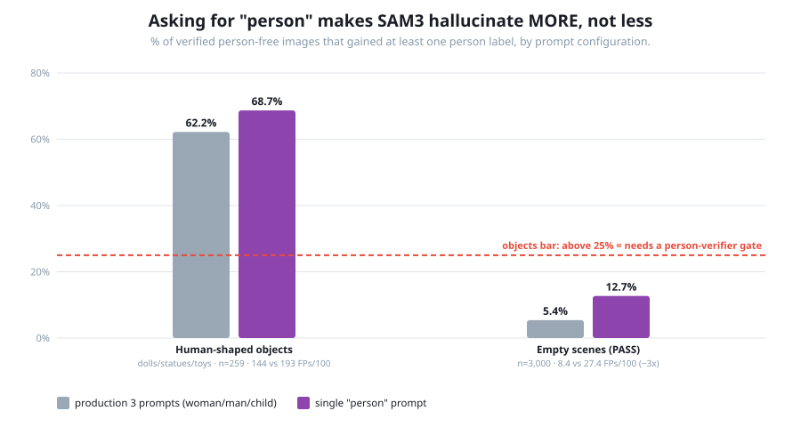
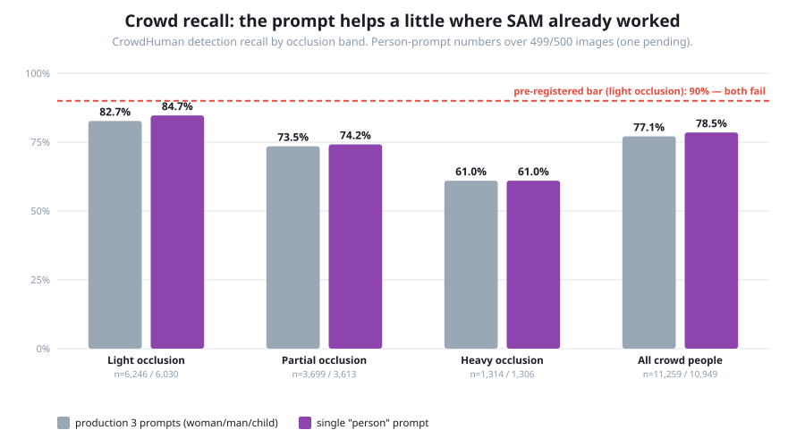
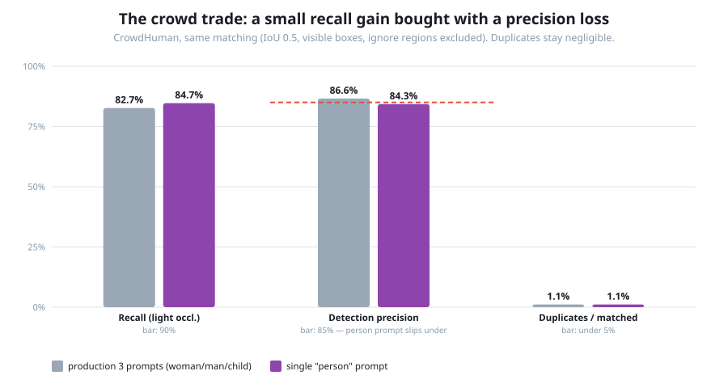

# Experiment: Measured purely as a person detector, how does SAM3 do — and does the prompt matter?

**In one line:** first experiment under the three-component framework — we re-run the production
SAM3 labeler with a **single "person" prompt** (instead of the production woman/man/child prompts)
on the same three staged detection datasets from EXP-2026-03, scoring it as **Component 1: Person
Detection** only, with EXP-2026-03's 3-prompt numbers as the direct baseline.

**Status:** Run complete 2026-07-14 (one caveat: 1 of 500 crowd images — 310 GT persons — has no
label file and is excluded pending a re-run check, see §2.5) · PASS 3,000 / objects 259 /
CrowdHuman 500-image sample — identical staged data to EXP-2026-03 · Pod: L4 (same class as the
EXP-2026-03 baseline; an initial attempt on an RTX PRO Blackwell pod failed with the known sm_120
CUDA kernel error and produced no labels) · Owner: Mostafa

> **How to read this doc.** §1 is the executive summary (fills in once we have numbers). §2 is the
> plan. §3 is the appendices — verbatim method and thresholds, written before running. The
> component definitions live in `docs/COMPONENT_FRAMEWORK.md` — this doc measures Component 1 and
> nothing else.

---

# 1 · Executive summary

### Bottom line

**The three gendered production prompts were acting as an accidental specificity filter. Asked
simply for "person", SAM3 fires far more liberally everywhere — and it hurts more than it
helps:**

- **Empty scenes got ~3× worse.** PASS false positives jumped from 8.4 to **27.4 per 100
  images** (12.7% of empty images gain a person label, vs 5.4% with the production prompts) —
  from "in-between" straight past the >10 "real problem" bar.
- **Human-shaped objects got worse too:** 68.7% of doll/statue images gain a false person label
  (vs 62.2%), with **+34% more spurious boxes** (193 vs 144 per 100 images). Prompting does not
  fix the form-matching failure — it amplifies it. The person-verifier gate is mandatory either
  way.
- **The crowd trade is small and mixed:** lightly-occluded recall improved 82.7% → **84.7%**
  (+2.1 points — real, but under the pre-registered 5-point adoption threshold and still failing
  the 90% bar), while precision slipped 86.6% → **84.3%**, just under the 85% bar. Heavy-occlusion
  recall didn't move at all (61%) — occlusion, not prompt phrasing, is the binding constraint.
- **Decision, per the pre-registered rules: do NOT adopt a person-prompt Stage 0.** The
  replacement pipeline keeps class-aware prompting (or gets a detector that isn't SAM3) and adds
  the person-verifier gate that both EXP-2026-03 and this run independently demand.

### Scorecard (bars set before running — results filled after)

Absolute bars are **identical to EXP-2026-03's** so verdicts stay comparable; the new column is
the 3-prompt baseline this run is compared against.

| Dataset | Metric | Bar (pre-registered) | 3-prompt baseline (EXP-2026-03) | "person"-prompt result |
|---|---|---|---|---|
| PASS | false positives per 100 empty images | < 2 negligible · > 10 real problem | 8.4 ⚠️ | **27.4** ❌ — ~3× worse; 12.7% of empty images gain a label (vs 5.4%) |
| Object set | % of human-shaped-object images that get a person label | > 25% = real FP source needing a gate | 62.2% ❌ | **68.7%** ❌ — worse; 193 FPs/100 (vs 144, +34%) |
| CrowdHuman | detection precision | ≥ 85% good · < 70% real noise | 86.6% ✅ (lower bound) | **84.3%** ❌ — slipped just under the bar (lower bound) |
| CrowdHuman | recall on lightly-occluded people | ≥ 90% | 82.7% ❌ (overall 77.1%) | **84.7%** ❌ — +2.1 pts (overall 78.5%*); under the 5-pt adoption rule |
| CrowdHuman | duplicates per matched person | < 5% | 1.1% ✅ | **1.1%** ✅ — unchanged |

\* Crowd numbers computed on 499 of 500 images (10,949 of 11,259 GT persons) — one image with 310
GT persons produced no label file; see §2.5.

**Comparative decision rules (pre-registered, before running):**

- **Crowd recall:** if the "person" prompt improves lightly-occluded recall by **≥ 5 points**, the
  replacement pipeline's Stage 0 should detect with a "person" prompt and leave classification to
  downstream components. Under 5 points = prompt choice is neutral for detection; pick on other
  grounds.
- **Object set:** if the "person" prompt cuts the false-person image rate to **below half the
  baseline (< 31%)**, prompting matters materially — but unless it falls under the 25% bar itself,
  the person-verifier gate stays mandatory either way. We expect it NOT to fix this: the failure
  is SAM matching human *form*, and "person" describes the same form.
- **PASS:** same < 2 / > 10 bands; any direction of change is informative but this dataset alone
  doesn't decide anything.

**Scope:** Component 1 (Person Detection) only. These datasets have no age/gender labels, so
Components 2 and 3 are structurally out of scope here (they were measured on LAGENDA in
EXP-2026-02 / EXP-2026-01, and the Gulf-dress slice for Component 3 still doesn't exist). Results
reported **per dataset, never pooled**.

---

# 2 · Plan

## 2.1 Why this experiment

Two reasons, one methodological and one practical:

1. **The component restructure demands it.** Under `docs/COMPONENT_FRAMEWORK.md`, Person Detection
   is its own component. EXP-2026-03 measured detection *through* the production three gendered
   prompts — detection and classification entangled in one pass, with cross-class NMS in play. A
   clean Component-1 measurement needs the detector asked the detector's question: "person". The
   user's framing: you can't re-score the old run as pure detection, because the prompts shaped
   what was detected — it has to be a new run.
2. **It decides a real design question for the replacement pipeline.** Stage 0 keeps SAM3 as the
   detector. Should it prompt "person" (then classify downstream) or keep per-class prompts? If
   the single prompt recovers meaningful crowd recall or drops hallucinations, that's a free win;
   if nothing moves, we've established the prompt is not the problem and the person-verifier gate
   carries the load.

## 2.2 What stays frozen

Everything except the prompt list. Same `autolabel_sam.py`, same checkpoint, same conf 0.4 and
NMS IoU 0.7 defaults, same three datasets byte-for-byte (staged under `/workspace/datasets/`
since EXP-2026-03 — the object set especially is hand-verified and must be reused, not rebuilt),
same Stage B scorer (`eval_negatives_crowd.py`, unchanged — its matching is class-agnostic), same
match IoU 0.5, same "person includes posters/photos, excludes dolls/statues/mannequins" ruling
(EXP-2026-03 §2.2).

One prompt-specific note: with a single class there is **no cross-class NMS** — the 0.7 NMS now
only merges same-prompt duplicates. That is part of what "single prompt" means, not a confound;
the duplicates metric will show its effect.

## 2.3 How we do it

1. **Stage A (pod, GPU, ~2h total):** run the frozen production labeler once per dataset with
   `--classes "person"`, writing to `/workspace/exp04/sam_labels/{objects,pass,crowd}`.
2. **Stage B (pod, CPU, minutes):** score each dataset with the unchanged
   `eval_negatives_crowd.py` (`--mode negatives` ×2, `--mode crowd`), `--class-names Person`,
   writing to `/workspace/exp04/eval/`.
3. **Compare:** fill the scorecard, per dataset, against the EXP-2026-03 baseline; overlay
   eyeball on the same buckets (doll FPs, crowd clear-FPs).

Copy-paste commands: `EXP-2026-04-POD-RUNBOOK.md` (same you-run-I-read pattern as EXP-2026-02/03).

## 2.4 What this does NOT tell us (pre-registered)

- **Confidence threshold is frozen at 0.4, tuned/frozen under the 3-prompt config.** The "person"
  prompt's score distribution may sit higher or lower; YOLO label files don't store confidences,
  so no post-hoc sweep is possible. If the person-prompt result is surprisingly bad OR good, a
  conf sweep (Stage A re-runs at 0.3/0.5) is the named follow-up before concluding anything about
  the prompt itself.
- **Nothing about Components 2–3.** A "person"-prompt Stage 0 would push all age/gender work onto
  downstream classifiers; this experiment does not measure whether those classifiers are ready
  (MiVOLO V2 = EXP-2026-05; Gulf-dress slice = still unbuilt).
- **CrowdHuman box-overlap caveats carry over from EXP-2026-03 §2.7** — recall is if anything an
  overestimate, precision a lower bound; verdict directions are overlap-proof.
- **LAGENDA prominent-subject recall is not re-measured here.** If the person prompt wins on
  crowds we should confirm it doesn't regress on prominent subjects before adopting it (cheap:
  Stage A on the LAGENDA sample + the detection-recall side of `run_autolabel_on_manifest.py`).

## 2.5 Results (run 2026-07-14, L4 pod; per dataset, never pooled)



**Object set (259 hand-verified doll/statue/toy images):** 68.7% of images gained at least one
false "Person" label (CI 62.8–74.1%; baseline 62.2%, CI 56.1–67.9 — the CIs overlap, but the raw
box count doesn't lie: **500 spurious boxes vs 373**, 193 vs 144 per 100 images). The
pre-registered expectation held: "person" describes exactly the human FORM these objects share,
so a broader prompt fires more, not less.

**PASS (3,000 verified person-free scenes):** **27.4 FPs/100 images, 12.7% of images affected**
(CI 11.6–13.9%) — vs the baseline's 8.4/100 and 5.4%. This is the cleanest evidence in the run
that the gendered prompts were acting as a specificity filter: on scenes with nothing human at
all, asking for "person" instead of woman/man/child roughly **triples** hallucinations, moving
PASS from the "in-between" band decisively past the >10 "real problem" bar.





**CrowdHuman (499 of 500 sample images scored — see caveat):** overall recall 78.5% (CI
77.7–79.2; baseline 77.1%), light occlusion 84.7% (baseline 82.7%), partial 74.2%, heavy 61.0%
(baseline 61.0% — identical). Precision 84.3% (CI 83.6–85.0; baseline 86.6%), duplicates 1.1%
(unchanged), clear FPs 357 (71.5/100 images; candidates for the poster-vs-hallucination
hand-check, same protocol as EXP-2026-03). The gain is concentrated exactly where SAM already
worked (lightly-occluded people); where it failed (heavy occlusion), the prompt changed nothing.

**The missing crowd image:** one of the 500 sample images has no `.txt` in the person-prompt run
(the 3-prompt run produced one for all 500). It carries **310 GT persons**, so its treatment
moves the headline: if SAM truly returned zero detections there, true overall recall is ~76.3%
(8,589/11,259), i.e. the +1.3-point overall gain could flip to a small loss. Resolution pending a
Stage A re-check (the labeler is resumable; if the re-run still writes no file, the labeler
writes nothing on zero detections — itself a finding, since it makes "unprocessed" and "found
nothing" indistinguishable to any scorer). Light-occlusion recall, precision, and duplicates are
per-detection/per-person rates over the 499 scored images and are less sensitive to this one
image, but the doc's numbers stay flagged until it's resolved.

**Gallery eyeball findings (owner review, 2026-07-15 — galleries built from the frozen labels,
`build_gallery_exp04.py`):**

- **PASS: verified.** The hallucinations are real hallucinations; the 27.4 FPs/100 stands.
- **Object set: CONTAMINATION FOUND — many images contain real people**, which the
  hand-verification pass (EXP-2026-03 Phase 1c) should have rejected. SAM firing on those is
  CORRECT per the §2.2 ruling, so **both object-set FP rates — EXP-2026-03's 62.2% and this
  run's 68.7% — are upper bounds.** The relative comparison (person prompt worse) is likely
  robust since both prompts ran on identical images, but absolute numbers are not clean.
  **Fix in progress:** a second rejects pass via the interactive gallery (mark RED = contains a
  real person / photo of one), then re-score BOTH prompt runs on the cleaned set — CPU-only,
  both label sets are frozen on the volume, no model re-run.
- **Crowd clear FPs: mostly not hallucinations.** The owner's skim says most of the 357 "clear
  FPs" are far-away real people CrowdHuman didn't annotate, or body-part boxes (a hand, a head)
  on real people. So **84.3% precision is a pessimistic lower bound**, as pre-registered.
  Body-part boxes are a distinct box-quality failure mode worth their own count in the tally
  (RED = genuine hallucination, BLUE = real person / body part, ORANGE = poster/statue).
  Precise three-bucket tally pending via the gallery's marking export.

**Decision (per the §1 pre-registered rules):** light-occlusion recall gained +2.1 points — under
the ≥5-point threshold — while precision dropped below its bar and both negatives datasets got
substantially worse. **Person-prompt Stage 0 is rejected.** The prompt is not the source of the
crowd-recall problem (occlusion is), and prompt phrasing cannot substitute for a person-verifier
gate — if anything the single prompt makes the gate work harder.

---

# 3 · Appendices

## Appendix A — setup

- **Datasets (unchanged from EXP-2026-03, reused in place):**
  - `/workspace/datasets/object_set/` — 259 hand-verified doll/statue/sculpture/teddy images
    (Open Images candidates, human-rejected any image containing a real person or a
    photo/poster of one, per the §2.2 ruling; per-class counts in EXP-2026-03 Appendix B).
  - `/workspace/datasets/pass_3k/` — 3,000 images, seed-51 sample of PASS.0.tar (Zenodo 6615455).
  - `/workspace/datasets/crowdhuman/Images_sample500/` — the exp03 seed-51 500-image sample dir
    (11,259 persons; confirmed on-volume 2026-07-14), `annotation_val.odgt` ground truth,
    visible-box matching. Stage A and Stage B both point at the sample dir, exactly as
    EXP-2026-03's Stage B did (its summary: 500 scored / 3,870 odgt entries not in the dir).
    Note: the object_set top level is exactly the 259 verified images; 11 extra files found in
    Phase 0 are Jupyter `.ipynb_checkpoints` copies in a subfolder, invisible to the scorer.
- **Outputs:** `/workspace/exp04/sam_labels/{objects,pass,crowd}` and `/workspace/exp04/eval/`.
  (Volume convention: datasets are shared, `expNN/` is experiment-specific.)
- **Pod:** L4 or A100, not Blackwell/sm_120. Stage A timing at the L4's measured ~1.08 it/s:
  objects ~3 min · PASS ~46 min · CrowdHuman ~68 min. With one prompt instead of three the
  per-image forward pass may be faster; treat those as upper estimates.

## Appendix B — "verify it yourself" (written BEFORE running)

### B.1 How the model is called

The one and only change from EXP-2026-03 is the `--classes` argument. EXP-2026-03 Stage A
(`EXP-2026-03-POD-RUNBOOK.md` Phase 2) ran:

```bash
python3 autolabel_sam.py --input /workspace/datasets/object_set \
    --output /workspace/exp03/sam_labels/objects \
    --classes "woman" "man" "child" --batch_size 1
```

This experiment runs, per dataset:

```bash
python3 autolabel_sam.py --input /workspace/datasets/object_set \
    --output /workspace/exp04/sam_labels/objects \
    --classes "person" --batch_size 1
```

`autolabel_sam.py` is the frozen production labeler at `/workspace/autolabel/autolabel_sam.py`
(pod-only). Defaults confirmed on the pod at run time (Phase 0, 2026-07-14), verbatim argparse
lines from the file:

```
78:    parser.add_argument("--conf", type=float, default=0.4, help="Confidence threshold (default 0.4)")
79:    parser.add_argument("--nms_iou", type=float, default=0.7, help="IOU Threshold for NMS to remove duplicates (default 0.7)")
83:    parser.add_argument("--batch_size", type=int, default=8, help="Number of class prompts to process in parallel per image")
```

Note the `--batch_size` semantics: it batches **class prompts**, not images — so with a single
"person" prompt it is effectively 1 regardless. Output class id 0 = "person" in the YOLO files.

_Honest gap:_ the labeler source is pod-only and not in this repo; we verify its settings at run
time rather than quoting frozen source here.

### B.2 How detections are parsed (verbatim, `vlm-cluster/run_autolabel_on_manifest.py:77`)

```python
def seg_boxes(label_file: Path, w: int, h: int):
    """Parse a YOLO label file that may contain segment polygons (class + 2N
    normalized coords) or plain boxes (class + cxcywh). Returns
    [(cls, x1, y1, x2, y2)] in pixels; polygon boxes are the polygon extent."""
    if not label_file.exists():
        return None                       # not processed (distinct from empty)
    boxes = []
    for line in label_file.read_text().splitlines():
        parts = line.split()
        if len(parts) < 5:
            continue
        try:
            cls = int(float(parts[0]))
            vals = [float(x) for x in parts[1:]]
        except ValueError:
            continue
        if len(vals) == 4:                # box: cx cy w h
            cx, cy, bw, bh = vals
            boxes.append((cls, (cx - bw / 2) * w, (cy - bh / 2) * h,
                          (cx + bw / 2) * w, (cy + bh / 2) * h))
        else:                             # polygon: x y x y ...
            xs, ys = vals[0::2], vals[1::2]
            if len(xs) < 3 or len(xs) != len(ys):
                continue
            boxes.append((cls, min(xs) * w, min(ys) * h,
                          max(xs) * w, max(ys) * h))
    return boxes
```

### B.3 How boxes are matched (verbatim, `vlm-cluster/run_model_children.py:44` and `:84`)

Matching is **class-agnostic** — class ids never enter it — which is exactly why the scorer works
unchanged for a single-prompt run:

```python
def match_boxes(gt_boxes, dets, min_iou):
    """Greedy, mutually-exclusive matching: each detection can match at most one
    GT box, each GT box gets at most one detection. Highest-IoU pairs are
    claimed first, so two nearby children in the same image can't both be
    'matched' to the same detection.

    Returns {gt_index: (det, iou)} for matched pairs only.
    """
    pairs = []
    for gi, gt in enumerate(gt_boxes):
        for di, d in enumerate(dets):
            j = iou(gt, d[1:5])
            if j >= min_iou:
                pairs.append((j, gi, di))
    pairs.sort(key=lambda p: p[0], reverse=True)  # best matches first
    used_gt, used_det, out = set(), set(), {}
    for j, gi, di in pairs:
        if gi in used_gt or di in used_det:
            continue
        used_gt.add(gi)
        used_det.add(di)
        out[gi] = (dets[di], j)
    return out

def iou(a, b):
    ax1, ay1, ax2, ay2 = a
    bx1, by1, bx2, by2 = b
    ix1, iy1 = max(ax1, bx1), max(ay1, by1)
    ix2, iy2 = min(ax2, bx2), min(ay2, by2)
    iw, ih = max(0.0, ix2 - ix1), max(0.0, iy2 - iy1)
    inter = iw * ih
    if inter <= 0:
        return 0.0
    ua = (ax2 - ax1) * (ay2 - ay1) + (bx2 - bx1) * (by2 - by1) - inter
    return inter / ua if ua > 0 else 0.0
```

CrowdHuman specifics (all in `vlm-cluster/eval_negatives_crowd.py`, unchanged from EXP-2026-03):
matched against the **visible box** (vbox); detections mostly inside ignore regions excluded
(IoA > 0.5); occlusion band = vbox/fbox area ratio; unmatched detections bucketed by best IoU vs
any GT person (≥ 0.5 duplicate · 0.1–0.5 partial/ambiguous · < 0.1 clear FP).

### B.4 How samples were selected

No new sampling. All three datasets are reused byte-for-byte from EXP-2026-03's staging (seed 51
for both the PASS 3,000-image sample and the CrowdHuman 500-image sample; object set fixed by the
committed `rejects.txt` hand-verification). Selection code: EXP-2026-03 Appendix B /
`EXP-2026-03-POD-RUNBOOK.md` Phase 1. The runbook's Phase 0 re-counts each directory to confirm
nothing changed on the volume.

### B.5 Every threshold and its source

| Threshold | Value | Where it lives |
|---|---|---|
| SAM3 confidence | 0.4 | `autolabel_sam.py` argparse default (pod; confirmed in runbook Phase 0) |
| SAM3 NMS IoU | 0.7 | same |
| Match IoU (det ↔ GT) | 0.5 | `eval_negatives_crowd.py:396` (`--match-iou` default) |
| Ignore-region exclusion IoA | 0.5 | `eval_negatives_crowd.py:70` (`IGNORE_IOA`) |
| Duplicate bucket IoU | ≥ 0.5 | `eval_negatives_crowd.py:72` (`DUP_IOU`) |
| Partial/ambiguous bucket | 0.1–0.5 | `eval_negatives_crowd.py:73` (`PARTIAL_IOU`) |
| Occlusion bands (light/partial/heavy) | ≥ 0.7 / 0.3–0.7 / < 0.3 | `eval_negatives_crowd.py:68` (`OCC_LIGHT`, `OCC_HEAVY`) |

_Honest gaps, same as EXP-2026-03:_ conf 0.4 and NMS 0.7 are frozen production values, not
calibrated for the "person" prompt (see §2.4); match IoU 0.5 is the conventional default — the
EXP-2026-03 closeout's 0.4/0.6 sweep applies here too and can reuse this run's Stage A output.

### B.6 What was NOT done

- No confidence sweep (impossible post-hoc — no confidences in YOLO output).
- No LAGENDA re-run with the "person" prompt (named follow-up in §2.4).
- No mask-level comparison — box extents only, same as all prior experiments.
- Overlay adjudications (poster-vs-hallucination tally on crowd clear-FPs) are a human step,
  same protocol as EXP-2026-03 Phase 4.
