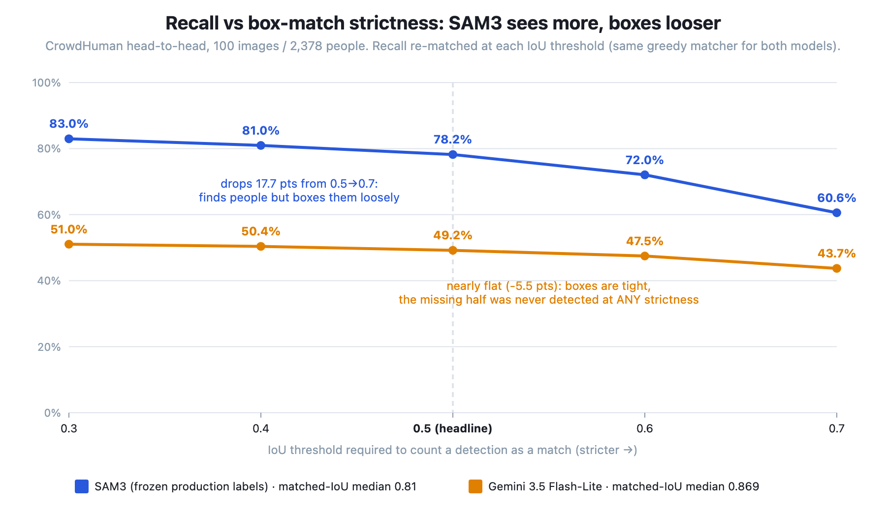

# Experiment: On crowd scenes, who gives better boxes AND better Man/Woman/Child labels — the production SAM3 auto-labeler or Gemini 3.5 Flash-Lite?

**In one line:** The first direct head-to-head between our two pipeline seats — SAM3 (detector) and
Gemini 3.5 Flash-Lite (gate/arbiter) — on the same 100 crowd images, scoring box quality against
CrowdHuman ground truth and 3-class labels by cross-model disagreement adjudication.

**Status:** Planned · 100 CrowdHuman images (~2,200 persons expected) · Owner: melkabir

---

## The short version

_(write LAST, after the run)_

- ...

## Why we did this

The replacement pipeline currently assigns SAM3 the detector seat and Gemini 3.5 Flash-Lite the
verifier-gate seat (EXP-2026-08 validated the gate: TP-keep 98.9%, ~$0.54/1k detections). But two
questions stayed open. First, Flash-Lite's only whole-image crowd numbers are an n=3 smoke test
(recall 42.5%, precision 61.7% — explicitly not a verdict); if it were actually competitive at
crowd detection, the pipeline could simplify. Second, we have **never compared the two models'
Man/Woman/Child labels on the same people** — SAM3's labels are what trains production today, and
Flash-Lite is the model we now trust to judge SAM3's output, so "do they even agree, and who's
right when they don't?" is a question the pipeline design leans on without data.

Crowds are the right slice because they're SAM3's measured weak spot (77% recall, silently missing
1-in-4 people — EXP-2026-03) and the hardest boxing environment.

## What we wanted to find out

**Components (named up front, per `docs/COMPONENT_FRAMEWORK.md`):**

- **Component 1 — person detection**: boxes scored against CrowdHuman visible-box ground truth
  (recall by occlusion band, precision, duplicates, matched-IoU tightness). One dataset, never
  pooled with anything.
- **Labels (Components 2+3 jointly, 3-class {Woman, Man, Child})**: **CrowdHuman has no gender or
  age ground truth**, so labels cannot be GT-scored. Instead: cross-model agreement on persons
  **both models found** (conditioning on the upstream component, per framework rules), plus human
  adjudication of the disagreement crops in the gallery. The adjudication — not any automatic
  metric — decides the label winner.

### The pre-registered bars (written before running anything)

1. **Detector seat (Component 1):** Flash-Lite challenges SAM3's crowd-detector seat only if its
   recall on these 100 images comes **within 5 points of SAM3's** AND its precision is **≥
   SAM3's**. Anything less: SAM3 keeps the seat and this experiment just prices the gap.
   (Priors: SAM3 77.1% / 86.6% on the full 500-image sample; Flash-Lite 42.5% / 61.7% at n=3.)
2. **Box quality:** on persons found by both, a **matched-IoU mean gap ≥ 0.05** counts as a real
   box-quality win for that model; below that we call boxes equivalent. (Prior: Flash-Lite had the
   tightest single-person boxes of any model tested, LAGENDA matched-IoU 0.914; SAM3's crowd
   tightness has never been measured — this run produces it.)
3. **Labels:** on adjudicated disagreement crops (excluding "both wrong" and "can't tell"), a
   model **wins the label question at ≥ 70%** of decided cases; 55–70% = leans that way; under 55%
   = tie. **Adult→Child disagreements are tallied separately** — an adult labeled Child escapes
   the blur, so whichever model makes that error more loses standing regardless of overall count.
4. **Agreement sanity check:** if 3-class agreement on both-found persons is **below 60%**, the
   models see the world too differently for a crop-sample verdict — we adjudicate more crops
   before concluding anything.
5. **Scoring rule fixed in advance:** a Flash-Lite response that fails to parse (truncation,
   malformed JSON) scores as **zero detections for that image** — an unreadable answer is the
   model's failure, not a scoring gap. Count reported.
6. **No AP in this experiment:** the frozen EXP-2026-03 SAM3 labels carry no confidence scores,
   so a confidence-ranked metric would exist for only one side. Skipped by design rather than
   compared asymmetrically.

**What this decides:** whether the pipeline stays "SAM3 detects → Flash-Lite gates" (current
design) or Flash-Lite earns a bigger crowd role; and, from the label adjudication, which model's
3-class opinion should carry more weight when the pipeline's votes conflict.

## How we did it

1. **The answer key (boxes only).** CrowdHuman val visible-box (`vbox`) annotations — exhaustive
   human boxes on every person, with ignore regions excluded from scoring, same conventions as
   EXP-2026-03. For labels there is no answer key; see step 5.
2. **The sample.** 100 images from the staged 500-image seed-51 CrowdHuman sample
   (`/workspace/datasets/crowdhuman/Images_sample500/`), selected by the same seeded shuffle
   `vlm_detect_eval.py` uses (seed 42), materialized on disk at `/workspace/exp09/subset100/`
   with a `subset_list.txt` manifest so the sample is frozen and auditable.
3. **SAM3 arm — no new run.** The frozen production labels from EXP-2026-03 Stage A
   (`/workspace/exp03/sam_labels/crowd/`, production `autolabel_sam.py`, prompts
   woman/man/child, conf 0.4, NMS IoU 0.7). Reusing the exact artifact production trains on is
   the point; a fresh run would measure a different (possibly drifted) system.
4. **Flash-Lite arm.** `vlm_detect_eval.py` with the frozen EXP-2026-06 detection prompt,
   `--box-prompt gemini` (its native y-first 0–1000 format — the production fix from the
   Gemini 3.6 addendum), `--max-tokens 8000`, thinking off (Flash-Lite's default). Output
   re-parsed with `reparse_boxes.py --write yxyx_1000` (diagnose mode run first and pasted into
   the appendix, so the convention choice is data-driven, not assumed).
5. **How we compared.** `vlm-cluster/crowd_headtohead.py` scores **both models with the same
   matcher on the same images**: greedy mutually-exclusive IoU-0.5 matching against GT vboxes,
   ignore-region exclusion, occlusion bands from vbox/fbox ratio — all inherited unchanged from
   the EXP-2026-03 scorer. Per GT person it records who found them, with what label and what IoU.
   Labels compare in 3-class space: SAM3's class is direct; Flash-Lite's
   (gender, age_group) maps by the pre-registered rule below. The gallery
   (`gallery.html`) then puts every label disagreement in front of a human.
6. **Definitions that matter.**
   - **Flash-Lite → 3-class mapping (pre-registered):** `age_group=="child"` → Child;
     otherwise gender man/woman → Man/Woman; adult with unknown gender → literal "Unknown"
     (always a disagreement, tallied separately so it can't hide). An *unknown age_group* with
     known gender counts as that gender's **adult** — defaulting ambiguous age to adult is the
     blur-safe direction (the same policy direction adopted for the teen band).
   - **Child cutoff:** Flash-Lite's prompt defines child as ≤12, matching production's intent.
     SAM3 has no numeric cutoff (its implicit fade was measured in EXP-2026-02).
   - **Occlusion bands:** vbox/fbox area ratio ≥0.7 light, 0.3–0.7 partial, <0.3 heavy.

## What we found

_(Part 1 run 2026-07-23. Label-adjudication rows PENDING — the gallery tallies are the one
remaining human step.)_

**Visual proof for every claim below:** `EXP-2026-09-evidence-report.html` (self-contained,
generated by `vlm-cluster/headtohead_report.py` from the same scoring primitives) — missed-people
frames, occlusion crops, each clear false positive as frame + zoomed crop, box-tightness
overlays, and all Child↔adult label conflicts.

| Question | Pre-registered bar | SAM3 | Flash-Lite | Verdict |
|---|---|---|---|---|
| Crowd recall (IoU 0.5) | Lite within 5 pts of SAM3 | **78.2%** [76.5–79.8] | 49.2% [47.2–51.2] | **SAM3 keeps the detector seat** — 29-pt gap |
| Crowd precision (lower bound) | Lite ≥ SAM3 | 86.5% | **93.2%** | Lite passes, but moot given recall |
| Matched-IoU mean, both-found (n=1,133) | gap ≥ 0.05 = real win | 0.824 | 0.845 | equivalent (0.021 gap, Lite's direction) |
| Label agreement (both-found) | <60% ⇒ escalate crops | — | — | **81.2%** [78.8–83.4] — adjudication valid |
| Adjudicated disagreements won | ≥70% win / 55–70% lean | PENDING | PENDING | PENDING |
| Adult→Child direction errors | tallied separately | PENDING | PENDING | PENDING |
| Cost (Flash-Lite, measured) | report | n/a | 152,794 in / 87,280 out tokens; ~$0.26 at press rates (unverified) | — |

Key findings behind the scorecard (2,378 GT persons on 100 images):

- **Occlusion is where the gap lives.** Recall by band, SAM3 vs Flash-Lite: light 85.8% vs
  62.9%, partial 74.1% vs 41.5%, heavy 62.5% vs **21.4%** — heavily occluded people are close
  to invisible to the VLM.
- **Tight-but-blind, again.** Lite's recall@IoU sweep is nearly flat (51.1% at 0.3 → 43.7% at
  0.7): what it misses was never detected, not loosely boxed. Its boxes on found people are the
  tightest we've measured in crowds (median IoU 0.869, 82.8% ≥ 0.75 vs SAM3's 0.81 / 65.8%).
  SAM3 shows the opposite shape — recall drops 17.7 pts from IoU 0.5→0.7, so a real slice of its
  "found" people are loosely boxed:

  
- **Lite adds almost nothing as a second detector.** SAM3-only: 727 persons; Lite-only: 37;
  union recall 79.8% = +1.6 pts over SAM3 alone. Its measured value is verification, not
  coverage — reconfirming the pipeline's seat assignment from the detection side.
- **Labels: 81.2% agreement on the 1,133 both-found persons.** Of 213 disagreements, 132 are
  Lite gender-abstentions ("Unknown" — it boxed the person but declined the gender; SAM3
  structurally cannot abstain). The 81 real class conflicts: 51 Man↔Woman flips and 31
  child-direction conflicts, including **24 where SAM3 says Child and Lite says adult** — prime
  suspects for SAM3's known adult→Child leak (the direction that escapes the blur). Adjudication
  decides.
- **4/100 Lite responses unparseable** — not truncation: Lite occasionally drifts from the
  requested `box_2d` array to per-coordinate keys with duplicates/typos (e.g.
  `"x_min": …, "ymin": …, "xmax": …, "xmax": …`), a malformation variant `extract_json`
  doesn't repair. Scored as zero detections per the pre-registered rule.
- **SAM3 fired 504 detections into CrowdHuman ignore regions vs Lite's 77** — SAM3 boxes
  heavily inside dense-crowd blobs the annotators marked unscoreable.
- **Scoring-convention note:** the head-to-head drops ignore-region detections *before*
  matching (the EXP-2026-03 convention, both models treated identically), which is why Lite
  reads 49.2% here vs 50.6% under `vlm_detect_eval`'s post-matching exclusion. SAM3's 78.2%
  is directly comparable to EXP-2026-03's 77.1% on the full 500.

## Part 2 — best-setup arms (added 2026-07-23; bars pre-registered BEFORE Part 2 ran)

**Honesty note first:** Part 2 was designed *after* Part 1's numbers were seen (owner request:
"measure each system at its best, not just at production settings"). The bars below were written
before any Part 2 command ran — but a reader should weigh Part 2 knowing its design is
post-hoc relative to Part 1.

**The question:** with each system at its best *general-purpose* setting — one configuration that
must work across all scenarios, not tuned per image — does Part 1's picture change?

**The arm (one lever, everything else frozen):**

- **L+ (Flash-Lite hi-res):** identical to Part 1's Lite arm except
  `--media-resolution high` — Google's MediaResolution mode requesting more image tokens
  (finer effective resolution). Part 1 used the API default, under which every image became
  ~1,100 image tokens regardless of pixel size; our harness never resizes client-side either way.
  Same frozen prompt, same yxyx box format, same 8000-token cap, same 100 images.
- **S+ (SAM3 low-conf) — DROPPED before running, owner decision 2026-07-23.** A conf-0.1 Stage A
  rerun scored at floors 0.1–0.5 was pre-registered here, then dropped on the owner's judgment
  that a sub-0.4 floor mostly admits junk. EXP-2026-07's measured conf distributions support
  this: ordinary in-the-wild FPs concentrate at conf ~0.55–0.63 (a lower floor admits exactly
  that band), and statue/doll FPs score ABOVE real people (mean 0.755), so no floor separates
  them anyway. **SAM3's Part 2 arm is therefore the same frozen production configuration as
  Part 1** — its "best setup" claim rests on EXP-2026-04 (prompt lever tested, rejected) and
  EXP-2026-07 (conf lever measured, gate rejected), not on an untested assumption. The
  `--sam-conf-floor` machinery stays in `crowd_headtohead.py` (tested by selftest) should the
  question ever be reopened.

**What is deliberately NOT swept, with the data-backed reason:**
- SAM3's prompt — the `"person"` prompt was already tested and REJECTED (EXP-2026-04: +2.1 pts
  light-occlusion recall, hallucinations tripled).
- SAM3's NMS IoU — duplicates are 1.1% and misses grade with occlusion, the signature of
  never-detected rather than suppressed.
- Lite's prompt and box format — already at their measured best (EXP-2026-06 + addenda).
- Lite's thinking mode — the harness has no force-on knob (only off); untested, noted honestly.

**Part 2 pre-registered bars:**

1. **L+ adoption:** hi-res becomes "Lite's best" only if recall gains **≥ +5 pts** over Part 1's
   49.2% at **≤ 2.5× input tokens/image** (~1,528 baseline). Below that, the default resolution
   stands and the extra cost isn't justified.
2. **Seat rule, best-vs-best:** same as Part 1 — L+ challenges the frozen SAM3 arm
   (78.2% / 86.5%) only within 5 pts recall AND ≥ its precision.
3. **Labels:** Part 1's adjudication remains the label verdict. Part 2 label distributions are
   reported descriptively only, unless the detection verdict flips (then the disagreement
   adjudication is redone on the winning configurations).

**Part 2 result (run 2026-07-23) — the knob is real, but Part 1 was already at maximum.**

The `--media-resolution high` batch run produced **byte-identical input tokens to Part 1**
(152,794 across the same 100 images) — deterministic tokenization, so the setting demonstrably
changed nothing. A 4-call diagnostic through the exact engine code path (google-genai SDK
2.14.0, 660×440 test image) explains why:

| `media_resolution` | input tokens |
|---|---|
| (default) | 1,095 |
| low | 275 |
| medium | 547 |
| high | **1,095** |

`low`/`medium` cut tokens — the plumbing works — and `high` equals the default:
**gemini-3.5-flash-lite's default vision resolution already IS the API's maximum.** Bar 1 closes
as *unreachable*, not failed — there was no higher setting to buy. (The only remaining
resolution lever would be client-side tiling — split the image, detect per tile, stitch — a
different architecture, out of scope here and noted as a possible follow-up.)

**Bonus: a free variance replicate.** Two runs of the identical configuration: recall
49.2% → 50.0%, precision 93.2% → 91.9%, parse failures 4 → 8. Run-to-run noise on Lite's crowd
numbers is ~±1 pt — context for reading every Lite figure in this doc.

**Part 2 scorecard**

| Arm | Recall | Precision | Matched-IoU mean | Input tok/img | Verdict vs bar |
|---|---|---|---|---|---|
| SAM3 frozen (Part 1 = its best; see S+ note) | 78.2% | 86.5% | 0.788 | n/a | reference |
| Lite default (Part 1) | 49.2% | 93.2% | 0.842 | 1,528 | baseline — already max resolution |
| L+ "hi-res" | 50.0% | 91.9% | (variance replicate) | 1,528 — identical; knob is a no-op at `high` | bar unreachable; run kept as replicate |

**Part 2 verdict: both models were already at their best general-purpose setup in Part 1.**
SAM3's prompt and confidence levers were previously tested and rejected (EXP-2026-04/07) and the
low-conf arm was dropped by owner decision; Flash-Lite's prompt/box format are at their measured
best and its resolution is at the API maximum. **Part 1's numbers ARE the best-vs-best
comparison**, and the detector-seat verdict stands.

## What we can decide from this

_(fill after the run)_

## What this does NOT tell us

Written before running, because these are design limits, not surprises:

- **Label correctness has no ground truth here.** The adjudication covers *disagreements*; on
  persons where both models agree, they could be *jointly* wrong and we'd never see it. The
  30-crop agreement-sample skim mitigates this but doesn't eliminate it — a shared bias (both
  models calling ambiguous figures "Man", say) survives this experiment.
- **Adjudication is single-owner and unblinded** — the crop captions show which model said what.
  A stricter design would hide attribution; accepted for speed, and it's the same standard every
  prior adjudication in this repo used.
- **Says nothing about the Gulf/traditional-dress gender bias** — still the biggest untested gap
  across all experiments. CrowdHuman crowds are general-domain.
- **Crowds skew adult**, so the Child row of the label comparison will be thin; this experiment
  cannot decide the age component (that's EXP-2026-05 / MiVOLO's job).
- **Box-overlap caveat (EXP-2026-03 §2.7)** applies to both models identically: in dense crowds a
  loose box can match a neighbor, so counting metrics are identity-swap-proof but the matched-IoU
  distribution can be slightly flattered. It cannot manufacture a *difference* between models
  scored by the same matcher.
- **Precision is a lower bound for both** — CrowdHuman doesn't annotate posters/depictions, which
  our ruling counts as people, and Flash-Lite's prompt says so while SAM3's doesn't (the same
  instructed-vs-uninstructed asymmetry noted in EXP-2026-06).
- **n=100 (~2,200 persons):** overall recall/precision get ±~2pt CIs; per-occlusion-band and
  per-class-label slices are noisier — read those directionally.
- **SAM3 labels are the frozen 2026-07 EXP-2026-03 artifacts.** If `autolabel_sam.py` or SAM3
  weights have changed since, that drift is invisible here — deliberately, since those artifacts
  are what the training pipeline actually consumed.

## What's next

- Feed the verdicts into `docs/PIPELINE_PROPOSAL_dual_vote_labeler.md` (vote weighting when SAM3
  and the gate disagree on a label).
- Update the Component 1 scoreboard in `docs/COMPONENT_FRAMEWORK.md`.
- If label adjudication is decisive, scale the loser-checks-winner direction: use the winner to
  flag the loser's labels on real training data (Track 2 machinery already exists).

---

## Appendix — the details

### Run commands

See `EXP-2026-09-POD-RUNBOOK.md` — phased copy-paste blocks (Phase 1 subset + SAM coverage check,
Phase 2 Flash-Lite run, Phase 3 reparse, Phase 4 scoring, Phase 5 adjudication). No GPU needed:
SAM3 labels are reused, Flash-Lite is API-billed, scoring is CPU.

### Plain-word definitions

- **Recall** — of the humans CrowdHuman annotators boxed, how many did the model box (IoU ≥ 0.5)?
- **Precision (lower bound)** — of the model's boxes (outside ignore regions), how many landed on
  an annotated person? "Lower bound" because unannotated real people/posters count against it.
- **Matched IoU** — box-fit quality on successful matches: 1.0 = pixel-perfect, 0.5 = barely
  matched.
- **Duplicates** — extra boxes on an already-found person (fragmentation).
- **recall@IoU sweep (0.3→0.7)** — recall re-matched at looser/stricter overlap. A steep rise at
  loose thresholds means "found people but boxed them sloppily"; flat means "never saw them".

### Appendix — "verify it yourself" (written BEFORE running)

**1. How SAM3 was called** — not called in this experiment; labels are the frozen EXP-2026-03
Stage A output, produced by (EXP-2026-03-POD-RUNBOOK.md, Phase 2):

```bash
python3 autolabel_sam.py --input /workspace/datasets/crowdhuman/Images \
    --output /workspace/exp03/sam_labels/crowd \
    --classes "woman" "man" "child" --batch_size 1
# production defaults: conf 0.4, nms_iou 0.7 (autolabel_sam.py, pod)
```

**2. How Flash-Lite was called** — `vlm_detect_eval.py` with the frozen EXP-2026-06
`DETECT_PROMPT` (vlm_detect_eval.py:61–92, includes the posters-count/dolls-don't person ruling)
and the Gemini-native box instruction (vlm_detect_eval.py:57–59):

```python
BOX_FORMAT_GEMINI = """\
- "box_2d": the bounding box as [ymin, xmin, ymax, xmax], each value an
  integer normalized to a 0-1000 scale relative to the image size."""
```

```bash
python3 vlm_detect_eval.py --engine gemini --model gemini-3.5-flash-lite \
    --images /workspace/exp09/subset100 --gt crowdhuman \
    --odgt /workspace/datasets/crowdhuman/annotation_val.odgt \
    --max-images 0 --seed 42 --box-prompt gemini --max-tokens 8000 \
    --out /workspace/exp09/lite_crowd
```

Boxes re-parsed as `yxyx_1000` via `reparse_boxes.py --write yxyx_1000` after a diagnose pass
(paste the diagnose table here: ___). Flash-Lite was stable y-first in the EXP-2026-06 addendum;
the diagnose pass re-verifies that on THIS run instead of assuming it.

**3. How boxes were matched** — the same function for both models, quoted in full
(run_model_children.py:44–66):

```python
def match_boxes(gt_boxes, dets, min_iou):
    """Greedy, mutually-exclusive matching: each detection can match at most one
    GT box, each GT box gets at most one detection. Highest-IoU pairs are
    claimed first, so two nearby children in the same image can't both be
    'matched' to the same detection.

    Returns {gt_index: (det, iou)} for matched pairs only.
    """
    pairs = []
    for gi, gt in enumerate(gt_boxes):
        for di, d in enumerate(dets):
            j = iou(gt, d[1:5])
            if j >= min_iou:
                pairs.append((j, gi, di))
    pairs.sort(key=lambda p: p[0], reverse=True)  # best matches first
    used_gt, used_det, out = set(), set(), {}
    for j, gi, di in pairs:
        if gi in used_gt or di in used_det:
            continue
        used_gt.add(gi)
        used_det.add(di)
        out[gi] = (dets[di], j)
    return out
```

**4. How SAM3's YOLO polygons become boxes** — run_autolabel_on_manifest.py:77–102 (`seg_boxes`,
polygon extent → xyxy pixels), unchanged from EXP-2026-02/03/04.

**5. The label mapping** — crowd_headtohead.py:69–91, quoted in full:

```python
def lite_label3(p: dict) -> str:
    """Map a vlm_detect_eval person record into production 3-class space.

    Pre-registered (EXP-2026-09 doc, before running):
      - age_group == "child"  -> Child (regardless of gender)
      - age_group "adult" OR "unknown" -> adult; an unknown age defaults to
        adult because adult = blurred = the acceptable error direction.
      - adult with gender man/woman -> Man/Woman; gender "unknown" -> the
        literal label "Unknown" (counts as a disagreement with any SAM label,
        tallied separately so it can't hide).
    """
    if p.get("age_group") == "child":
        return "Child"
    g = p.get("gender")
    if g == "man":
        return "Man"
    if g == "woman":
        return "Woman"
    return "Unknown"
```

**6. How samples were selected** — vlm_detect_eval.py:466–470, invoked once by
`crowd_headtohead.py --make-subset` (crowd_headtohead.py:502) and frozen to disk with a manifest:

```python
def select_images(images_dir: Path, n: int, seed: int):
    imgs = sorted(p for p in images_dir.rglob("*")
                  if p.suffix.lower() in IMG_EXTS)
    random.Random(seed).shuffle(imgs)
    return imgs[:n] if n > 0 else imgs
```

Source pool: `Images_sample500/` (itself a seed-51 sample of CrowdHuman val, per
`docs/DATASET_REGISTRY.md`). Subset seed: **42**, n=100. The materialized `subset_list.txt` is
the authoritative sample record.

**7. How balanced the data is** — knowable part: ~22.5 GT persons/image expected (CrowdHuman
val average), occlusion mix to be reported from the run (fill: light ___ / partial ___ /
heavy ___). NOT knowable: gender/age distribution — CrowdHuman has no such labels, which is the
whole reason the label comparison is adjudicated. Expect adult-heavy.

**8. Every threshold and where it lives**

| Threshold | Value | Source line |
|---|---|---|
| Match IoU (both models) | 0.5 | `crowd_headtohead.py` `--match-iou` default |
| recall@IoU sweep | 0.3/0.4/0.5/0.6/0.7 | crowd_headtohead.py:60 `SWEEP_IOUS` |
| Ignore-region exclusion (IoA) | 0.5 | eval_negatives_crowd.py:70 `IGNORE_IOA` |
| Duplicate bucket (best IoU vs any GT) | ≥0.5 | eval_negatives_crowd.py:72 `DUP_IOU` |
| Partial-overlap bucket | 0.1–0.5 | eval_negatives_crowd.py:73 `PARTIAL_IOU` |
| Occlusion bands (vbox/fbox) | 0.7 / 0.3 | eval_negatives_crowd.py:68 `OCC_LIGHT, OCC_HEAVY` |
| Crop padding (gallery) | 25% | crowd_headtohead.py:61 `CROP_PAD` |
| Subset seed / size | 42 / 100 | runbook Phase 1 |
| Agreement-sample seed | 7 | crowd_headtohead.py:62 `GALLERY_SEED` |
| Flash-Lite output cap | 8000 tokens | runbook Phase 2 (`--max-tokens`) |
| SAM3 conf / NMS IoU | 0.4 / 0.7 | `autolabel_sam.py` defaults (pod), frozen in EXP-2026-03 |
| L+ media resolution (Part 2) | high | runbook Phase 6 (`--media-resolution`), plumbed in api_describers.py `GeminiDescriber` |
| S+ conf floor (Part 2) | DROPPED — arm cancelled before running (doc §Part 2); `--sam-conf-floor` machinery remains in crowd_headtohead.py, unused | — |

**9. What was NOT done (honesty section)**

- No fresh SAM3 run — the arm is the frozen EXP-2026-03 artifact (deliberate; see §How, step 3).
- No AP / confidence-ranked metric — SAM3's frozen labels carry no scores (pre-registered skip).
- Thresholds are inherited from EXP-2026-03/06, not recalibrated for this comparison.
- Adjudication is unblinded and single-owner (see "What this does NOT tell us").
- `model_pricing.json` still holds `null` for gemini-3.5-flash-lite (rates are press-reported,
  screenshot verification pending — an open item since EXP-2026-08). Token counts are measured
  either way; the $ figure fills in via `recompute_costs.py` once rates are verified.
- Self-test: `python3 crowd_headtohead.py --selftest` (synthetic, no data/network/GPU) — passed
  locally 2026-07-23 before any real data was scored.
