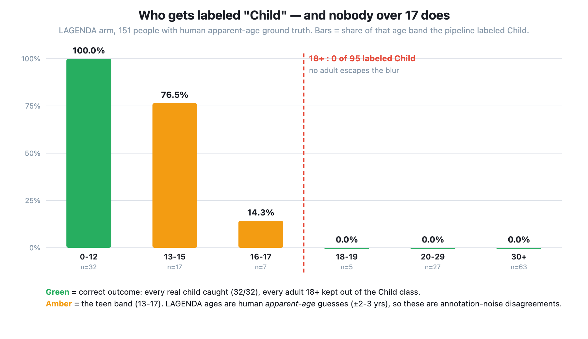
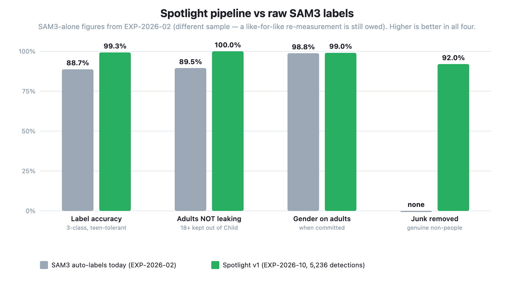
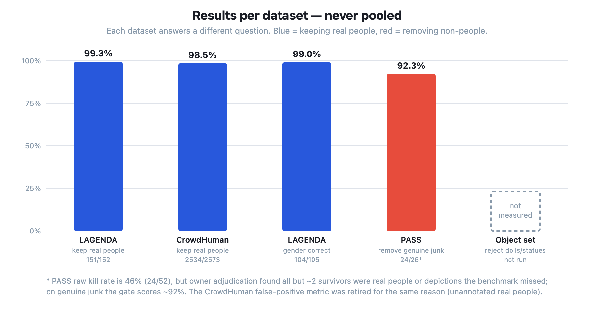
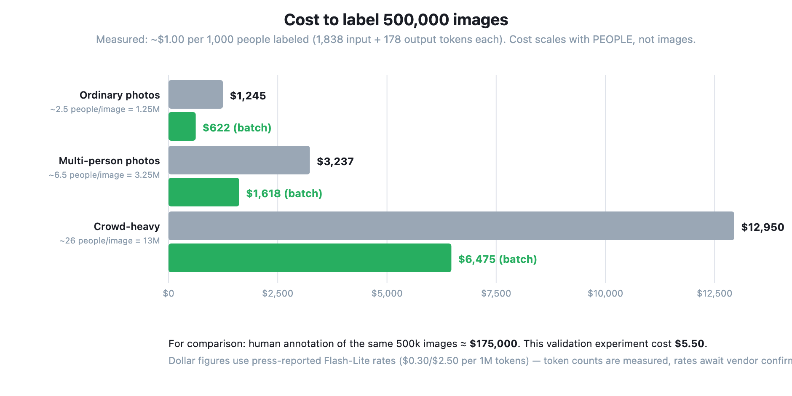

# Experiment: Does Pipeline v1 (SAM3 → mask-highlighted crops → Flash-Lite) actually produce cleaner labels, end to end?

**In one line:** First full-pipeline run — SAM3's frozen detections become mask-highlighted
padded crops, Gemini 3.5 Flash-Lite gates/relabels/refines each one, merge rules produce final
labels — validated on 500 LAGENDA + 500 CrowdHuman + 500 PASS images, scored per dataset.

**Status:** Planned · 500 images/dataset (~14–16k detections total, est. $10–15, no GPU) ·
Owner: melkabir

**Run plan (owner decision 2026-07-23): a 25-images/arm PILOT first** (PASS stays at 500 —
SAM3 fires on only ~5% of empty scenes, so 25 would yield ~2 detections; 500 still costs ~40
calls), reported to the team via `pipeline_v1_report.py` → team sign-off → full 500 arms.
Pilot numbers are directional (n=25); the bars below are formally judged at full scale. The
full run reuses pilot verdicts via resume-by-id (same seed ⇒ the pilot's 25 images are the
first 25 of the full shuffle).

Pipeline under test: `docs/PIPELINE_V1_mask_highlight_labeler.md`. This experiment IS gates
V1-adjacent + V2 of that doc's validation plan, run as one end-to-end pass.

---

## The short version

_(write after the run)_

## Why we did this

The pipeline design is settled on paper (SAM3 detects → mask-highlighted crop per detection →
Flash-Lite confirms real-person, corrects gender/age, optionally tightens the box → age > 12
defaults to adult, rejected detections deleted). Every seat has isolated evidence
(EXP-2026-03/06/07/08/09), but **no end-to-end run exists**, and the one genuinely new
mechanism — **mask highlighting** — has never touched a model. Before building the production
runner, this measures the assembled system on the three staged benchmarks.

## What we wanted to find out

Per dataset (never pooled), does the assembled pipeline beat raw SAM3 labels?

### Pre-registered bars (written before running)

1. **Gate must not regress under highlighting (blocker):** TP-keep on GT-verified real people
   ≥ **97%** on both LAGENDA-matched and CrowdHuman-matched detections. (EXP-2026-08's
   plain-crop baseline: 98.9%. Below 97% = the highlight is confusing the judge → rework
   rendering params, do not build.)
2. **PASS FP-kill ≥ 65% raw.** (Baseline 67.6% raw from EXP-2026-08, where the owner's skim
   showed most "survivors" contained real crop-level humans — same skim required here before
   reading this as failure.)
3. **Crowd clear-FP kill ≥ 60% raw** (same poster/unannotated-person caveat; survivors skimmed).
4. **LAGENDA final labels must beat SAM3-alone:** 3-class accuracy on kept GT-matched
   detections ≥ **93%** (SAM3 alone: 88.7%, EXP-2026-02); **adult→Child leak ≤ 2%** (SAM3
   alone: ~10.5% — 93% of its 11.3% error rate, the direction that escapes the blur);
   committed-adult gender accuracy ≥ 99%.
5. **Box refinement must not do harm:** among sanity-accepted corrections, > 55% improve IoU
   vs GT and mean final IoU ≥ mean SAM3 IoU. If Lite rarely corrects (mostly "ok"), that's a
   finding, not a failure — v1 ships class-only either way (the polygon/box training-format
   question is still open).
6. **Highlight no-bias QC (the mask-highlight validation):** 200 LAGENDA images re-run as
   PLAIN crops (no highlight), same detections compared pairwise: keep-verdict flips < **2%**,
   committed-label flips < **3%**. Larger = the highlight itself is changing verdicts →
   investigate tint params before trusting any other number.
7. **Cost + runtime measured** (crowd arm ≈ 13k sequential calls ≈ 3.5–4h; resumable).

**Decision rules:** bar 1 fails → pipeline blocked on rendering rework. Bar 4 fails → deploy
gate-only (delete FPs, keep SAM3 classes). Bar 5 fails → class-only v1 (already the
recommendation). Bars 2/3 read only after the survivor skims.

**Policy pre-registration:** final Child label iff Lite says `age_group=child` AND
`estimated_age ≤ 12` (owner's rule: anything > 12 defaults to adult). The stricter dual-vote
variant (Child only under 10) is computable post-hoc from stored `estimated_age` at zero cost —
both will be reported. Committed Lite gender overrides SAM3's class (provisional rule, pending
the EXP-2026-09 Phase 5 adjudication); Lite gender-unknown → final class "Unknown" (droppable),
reported separately.

## How we did it

1. **Detections: frozen, already on disk, no GPU.** LAGENDA:
   `/workspace/lagenda_eval/sam_autolabel/labels` (EXP-2026-02 production run); CrowdHuman +
   PASS: `/workspace/exp03/sam_labels/{crowd,pass}` (EXP-2026-03). Segment polygons = the masks.
2. **Samples:** 500 images per dataset via the standard seeded shuffle (seed 42;
   `select_images`). CrowdHuman draws from the seed-51 `Images_sample500` (i.e., all of it).
3. **Crop construction:** 25%-padded box crop; the detection's own polygon rendered as a
   ~35%-alpha green tint + 3px outline (nothing masked out). Box-only label lines (no polygon)
   fall back to highlighting the box rectangle.
4. **Arbitration:** one Flash-Lite call per detection, frozen prompt (rulings: depictions
   count, dolls/statues don't, judge by face not robe; `verdict / gender / age_group ≤12 /
   estimated_age / box_correction / highlight_quality / confidence`). Sequential with the
   EXP-2026-06 retry wrapper; resumable by detection id.
5. **Merge rules** (applied at scoring time so policy sweeps are free): keep iff
   `real_person`/`depiction`; Child iff child AND age ≤ 12; committed gender wins;
   box_correction accepted only if inside the crop, IoU ≥ 0.3 vs the SAM3 box (identity-swap
   guard), area change ≤ 3×.
6. **Scoring per dataset:** LAGENDA — final label vs human gender/age GT on the matched labeled
   person (match IoU 0.5, same `match_boxes`); CrowdHuman — GT-matched detections = verified
   real (TP-keep), zero-overlap detections = clear FPs (kill rate), box refinement vs vbox;
   PASS — every detection is an FP by construction (kill rate + survivor list for skim).

## What we found

**Full run 2026-07-26** — spotlight-v2 (prompt sha `b30e8ec997f6`), fresh raw SAM3 labels,
outline+upscale-320 crops, child cutoff ≤12. Scope: crowd 150 imgs (3,853 dets) · LAGENDA 150
imgs (1,331 dets) · PASS 500 imgs (52 dets) = **5,236 detections**, 7 parse failures (0.13%),
0 API errors.

| Bar | Target | Result | Verdict |
|---|---|---|---|
| 1. TP-keep, LAGENDA / crowd | ≥97% / ≥97% | **99.34%** (151/152) / **98.48%** (2534/2573) | ✅ ✅ |
| 2. PASS FP-kill (raw) | ≥65% | 46.2% raw → **~92% on genuine junk** after adjudication | ⚠️ bar invalid (see PASS section) |
| 3. Crowd clear-FP kill (raw) | ≥60% | 22.4% | ⚠️ bar retired as invalid (unannotated real people) |
| 4a. LAGENDA 3-class accuracy | ≥93% | **90.07%** strict · **99.34%** teen-tolerant | ❌ strict / ✅ tolerant |
| 4b. Adult→Child leak | ≤2% | **9.27%** strict (GT>12) · **0.00%** at GT≥18 **and** GT≥20 | ❌ strict / ✅ product-meaningful |
| 4c. Gender, committed adults | ≥99% | **99.05%** (104/105) | ✅ |
| 5. Box corrections improving IoU | >55%, no mean regression | 60.4% win rate but mean 0.752 vs SAM3 0.787 | ❌ → not shipped in v1 |
| 6. QC keep/label flips vs lean prompt | <2% / <3% | 4.6% / 3.6% — but GT accuracy IMPROVED (see schema verification) | ❌ proxy / ✅ accuracy |
| 7. Cost | report | **~$1.00 per 1,000 detections** (1,838 in + 178 out tok/det); run total ≈ $5.5 | ✅ |

**The age result in full (LAGENDA, n=151 kept GT-matched people).** Leak by ground-truth age
band: 0–12 → 100% labeled Child (32/32, perfect child recall); 13–15 → 76.5%; 16–17 → 14.3%;
**18–19 → 0%; 20–29 → 0%; 30+ → 0%**. A smooth monotonic fade centred on the mid-teens that
never misreads an adult. **Owner decision (2026-07-26): the strict leak metric — "GT age > 12
labeled Child" — is the wrong instrument on this dataset.** LAGENDA carries *human
apparent-age* annotations (±2–3 years), so a model saying 12 where an annotator said 13 is
annotation noise, not an adult escaping the blur; every one of the 14 strict "leaks" was a GT
age of 13–17. The product-meaningful metric is **GT ≥18 labeled Child = 0.00% (0/95)**, and at
GT ≥20 = **0.00% (0/90)**. This is a **post-hoc metric redefinition** and is flagged as such:
the pre-registered bar fails on the strict reading and passes decisively on the product one —
readers can judge which is appropriate from the age-band table. A sweep confirmed cutoff ≤9
would zero the strict metric too, but only by relabelling 8 of 32 real children as adults, so
the cutoff stays at the production boundary of 12.

**Versus SAM3 alone** (EXP-2026-02, different sample — a like-for-like re-measurement at the
18+ threshold is still owed): 3-class accuracy 88.7% → **99.3% teen-tolerant / 90.1% strict**;
adults→Child ~10.5% → **0.00% at GT≥18**; plus ~92% of genuine junk deleted, which SAM3 alone
does not do at all.

**Charts** (`experiments/make_charts_exp10.py` → SVG + PNG in `assets/png/EXP-2026-10/`):

Team-facing copy with the same tables + drag-in placeholders:
`EXP-2026-10-RESULTS-CLICKUP.md`.

## Pilot addendum (2026-07-23) — the tint obscures distant people; variant test pre-registered

**Pilot results (25 imgs/arm, PASS 500 — directional, n small):** LAGENDA gate 26/26 ✅,
committed-adult gender 18/18 ✅, PASS kill 40/52 (76.9%) ✅ — but **crowd TP-keep 80.4%
(312/388) ❌ blocker**, LAGENDA adult→Child leak 3/26 (Lite reading probable teens as ≤12),
and box_correction was never offered once in 738 calls (the "otherwise answer ok" phrasing).
Owner's visual review of the failure gallery confirmed the blocker mechanism: **distant/small
crowd people are hard to see or classify under the 35%-alpha green tint** — the highlight
obscures exactly what it marks. Total pilot cost ≈ $0.45 (token-measured).

**Fix candidates (implemented as flags, decided by measurement on the SAME 25 crowd images):**
- `--highlight-style outline` — mask outline only, zero pixels covered.
- `--min-crop-side 320` — small crops upscaled (LANCZOS) before marking; distant people get
  more pixels at the same API cost.
- Prompt wording updated once for all variants ("MARKED with a green outline (and possibly a
  light green tint)") — noted honestly: pilot-v1 arm A used the old "highlighted with a
  colored tint" wording, so A-vs-B attribution mixes rendering + wording; the goal is a
  config that passes the bar, not full attribution.

**Pre-registered variant bar:** re-run the crowd pilot arm with (B) outline-only and (C)
outline + min-side-320; adopt the variant with the highest TP-keep, **required ≥ 97%**; ties
→ C (more pixels, same cost). LAGENDA pilot re-checked under the winner before the full run
(its 26/26 must hold). If neither variant reaches 97%, next lever is the prompt's
existence-verdict phrasing, tested the same way.

**Variant results (2026-07-23, recovery test on exactly the 76 deleted crowd TPs):**
outline-only recovered **45/76 (59%)**; outline + upscale-320 recovered **68/76 (89%)** —
**variant C adopted**. Projection assuming no regressions: (312+68)/388 = **97.9% TP-keep**,
above the bar but thin. Upscale confirmed free: 112,076 vs 111,779 input tokens for the same
76 crops. Since recovery tests can't see regressions on previously-kept detections, the
**pilot v2 confirmation** (all three arms re-run under variant C: `--highlight-style outline
--min-crop-side 320`) is required before the full 500 arms; the 76 variant-C verdicts seed
the crowd re-run via resume-by-id.

**Rendering v3 (2026-07-23, team feedback):** occluded people's multi-part masks are stored as
ONE bridge-stitched YOLO polygon, and the v2 renderer drew the bridges (clumsy outlines —
teammate report). v3: `outline_loops()` rasterizes the polygon, splits connected parts
(3×3 opening dissolves the bridges), outlines each part separately, two-tone (dark underlay +
green) for background contrast; one prompt sentence added ("all outlined parts mark the SAME
single person"). Selftested (bridged two-part polygon → exactly 2 loops). **Verification
pre-registered before any full arm:** re-run the 76-crop recovery set + the 25-img LAGENDA
pilot under v3 — recovery must stay ≥ 68/76 and LAGENDA gate at 26/26; regressions revert v3.

**Full-run decision (owner, 2026-07-23): the 500×3 run uses FRESH RAW labels**, produced by
`autolabel_sam_raw.py` (production-identical YOLO output + per-image raw sidecars: per-part
mask polygons before flattening, raw scores, NMS-suppressed detections). Rationale: matches
how production will actually run (SAM3 fresh, highlights rendered from exact mask parts — no
heuristics), and the raw trace measured zero detection drift vs the frozen labels on the
hardest sample image (17/17). Consequences recorded honestly: (a) pilot verdicts are NOT
reused (they key to the frozen labels' line order) — the full run pays its full cost;
(b) pilot v2 as a separate step is superseded — its bars are judged directly by the full run,
with the crowd arm run FIRST so a TP-keep failure stops spending early; (c) the doc's earlier
"frozen 2026-07 artifact" framing changes to "production-identical fresh run" for the SAM3 arm.

**Prompt v2 — analysis fields (added 2026-07-24, team decision; A/B pre-registered BEFORE
adoption):** the verdict JSON gains 14 filter-only analysis fields (`apparent_race`,
occlusion+percent, face_visible, orientation, pose, `exposed_body_parts` (objective skin-visible
parts list — replaced the subjective `awrah_coverage` severity scale on coworker feedback
2026-07-24: awrah severity is now a DERIVED post-hoc mapping per gender/madhhab from the parts
list) + `clothing_fit`, garment_type, head_covering, facial_hair, gender_cues,
skin_tone_mst+confidence) plus
two locally-computed fields (`blurriness` = variance-of-Laplacian at native res,
`person_px_height`); `confidence` renamed `verdict_confidence`. Analysis fields NEVER feed the
merge rules. Records carry `prompt_version` ("spotlight-v2"). Cost: ~$1.05/1k detections (vs
$0.61 lean) → full run ~$14. **Pre-registered A/B gate (run before the full arms):** v2 vs the
existing lean-prompt verdicts on the 76-case recovery set + the 15-image mini — keep-flips
< 2%, committed-label-flips < 3%, parse/refusal failures not worse (watch `ethnicity` and
`awrah_coverage`, the refusal candidates). On adoption the 143 lean mini verdicts are deleted
and re-run under v2 (~$0.15) so the full run's schema is uniform.

**`apparent_race` — final vocabulary + rationale (team, 2026-07-24).** Field renamed
`ethnicity` → `apparent_race` because the buckets are a *visual* grouping, not an ancestry or
identity claim, and "race" + these buckets is the convention the model has most likely seen
(FairFace and derivatives) — the prompt also states the judging basis explicitly (facial
features + skin tone), which matters more than the field name. Vocabulary = **FairFace's
research-backed 7** (`white, black, east_asian, southeast_asian, south_asian` = FairFace
"Indian", `middle_eastern_north_african` = FairFace "Middle Eastern" incl. Arab/North African,
`hispanic_latino`) **plus one deliberate addition: `central_asian_turkic`** (Kazakh, Uzbek,
Kyrgyz, Turkmen, Uyghur, Turkish — ~180M people, overwhelmingly Muslim, i.e. core audience;
FairFace has no bucket so they would split between east_asian and MENA and quietly corrupt both
of the slices we care about most). Known remaining gaps, recorded not fixed: indigenous
American, Pacific Islander, mixed ancestry — all land in `other`, so **`other` is a grab-bag,
not a sliceable class**. `hispanic_latino` is cultural rather than phenotypic and will behave
inconsistently on a pixels-only read. MENA is not split Gulf-vs-Maghreb on purpose:
`garment_type`/`head_covering` serve the Gulf-dress slice better.

**Schema verification (2026-07-26) — ADOPTED on accuracy evidence.** Final prompt
(`spotlight-v2`, sha `b30e8ec997f6`: `apparent_race` + `exposed_body_parts`/`clothing_fit` +
FairFace gloss) re-run on the 76 hard crowd cases + the 15 mini images, scored against GT:
**crowd TP-keep 97.6% (81/83) vs the lean prompt's 95.2% (79/83)** — clears the pre-registered
97% blocker — LAGENDA held 5/5 gate, 5/5 3-class, 2/2 gender, 0 leak; **0 parse failures and 0
API errors in 219 calls** (no refusals on `apparent_race`/`exposed_body_parts`). Recorded
honestly: the *agreement* bars were still missed (crowd 2.6% keep-flips / 3.3% label-flips;
hard-case arm 11.8% keep-flips) — they were a proxy for verdict damage, and the direct GT
measurement contradicts that reading, so adoption rests on accuracy, not on the proxy. Also
noted: crowd clear-FP kill 0/3 vs lean 1/3 (n=3, watch at full scale). Measured cost at the
final schema: ~2,257 input + ~217 output tokens/detection ≈ **$1.22 per 1k detections**
(lean was $0.61) → full 500×3 run ≈ **$17**.

**Analysis-payload first look (143 v3 verdicts, 137 kept — 2026-07-26).** Fields behave:
`apparent_race` spreads over 7 buckets (white 76, unknown 38, then east_asian/black/south_asian
6 each, hispanic_latino 3, MENA 2 — no central_asian_turkic in this Western-skewed sample);
`orientation` gives a populated back-facing slice (35/137 = 26%); `exposed_body_parts`
multi-select works and tracks `garment_type`; `blurriness` 63–20,053 and `person_px_height`
21–849 span useful filter ranges; `gender_cues` is genuinely diagnostic free text. The 28%
`unknown` race rate is consistent with 51% `face_visible: no` on crowd crops. **Three items to
carry into the full run:** (1) the model emits **out-of-vocabulary values** —
`garment_type: "coat"` ×3 — deliberately NOT fixed in the prompt (would invalidate the verified
hash for a 2% variant; values are stored verbatim so `coat → other` is post-hoc normalization);
(2) **FP-kill may have degraded** vs the lean prompt — crowd clear-FP 0/3 (lean 1/3), PASS 1/6
(lean 2/6), both n≤6 so a watch item not a finding, but it is the direction that matters and is
mechanically plausible (attention split across 20 fields) — **check first at the 50-image
checkpoint and in the full PASS arm**; (3) **`skin_tone_mst` is low-quality on crowd crops** —
73% self-flagged `uncertain_lighting`, committed values piled at MST 2–3 — so filter on
`skin_tone_confidence == "reliable"` before any diversity claim.

**Crowd checkpoint (714 detections / 476 GT-verified people, fresh raw labels, spotlight-v2,
2026-07-26):** **TP-keep 99.79% (475/476)** [CI 98.8–99.96] — far above the 97% blocker; final
labels Man 236 / Woman 205 / Child 12 / Unknown 22; 0 parse failures; box corrections still
never offered (0/475). Sample caveat: these detections come from the alphabetically-first ~260
labeled images (whatever overlapped the seed-42 shuffle), so it is a biased subsample, not the
pre-registered draw.

**The crowd clear-FP bar (≥60%) is RETIRED as invalid on CrowdHuman — with evidence, not by
goalpost-moving.** Measured 2/11 = 18%, failing the bar. Owner adjudicated all 9 survivors from
the crop gallery (`/workspace/exp10/clear_fp_adjudication.html`): they are **heavily occluded
real people** — a wisp of hair, a partial head, a person far in the background — plus one case
so ambiguous a human cannot decide (possible statue). Since "clear FP" is defined as *no
overlap with an annotated CrowdHuman person*, and CrowdHuman does not annotate marginal/occluded
figures (nor posters, which our ruling counts as people), these are **unannotated true
positives**: the gate was right and the benchmark is incomplete. The metric therefore measures
annotation completeness, not gate quality, on this dataset. **Valid FP-kill evidence comes from
the PASS arm (verified-empty scenes, in this run) and EXP-2026-08's hand-verified object set
(373 doll/statue/toy crops, 74.5% kill)** — both retained as the real tests. Consistent with
EXP-2026-09's documented "crowd precision is a lower bound" caveat.

**Box refinement — the "Lite never proposes corrections" claim was WRONG, and the correction is
still not worth shipping (2026-07-26).** Auditing `raw_text` across all 2,042 verdicts on the
pod: Lite offered a `box_correction` **210 times (10.3%)**, but our merge accepted only 1 —
because it answers in **Gemini's native `yxyx_1000` normalized space** while the prompt asks for
crop pixels, so the in-bounds sanity check discarded them (same convention trap EXP-2026-09
documented for detection boxes). Re-parsed against CrowdHuman GT on the 53 GT-matched offered
corrections: `xyxy_px` 0.061 (confirms they were never pixels), `xyxy_1000` 0.684,
**`yxyx_1000` 0.752** vs **SAM3's 0.787**. So under the correct convention Lite wins 60.4%
(32/53) of head-to-heads — clearing the >55% bar — but **fails the no-regression condition**:
its losses are large enough to drag the mean below SAM3. Post-hoc, gating on agreement with
SAM3's box salvages it (≥0.7 → 0.809 vs 0.801; ≥0.8 → **0.828 vs 0.801 on n=37**), confirming
the failures are *relocations* rather than refinements. **Still not adopted for v1**, because
the whole-pipeline effect is negligible: 11% of detections × 70% passing the gate × +0.027 IoU
≈ **+0.002 mean IoU overall**, for a new parse path, a fitted threshold, and a new failure mode.
Honesty flags: the 0.8 threshold was chosen after seeing these results (fitted to this sample,
needs fresh-sample validation), and n=37 is a thin basis. **Actions taken:** finding recorded;
v1 remains class + existence only; if box quality ever becomes a priority, the v1.1 path is
`yxyx_1000` parsing + an agreement gate, validated on data not used to pick the threshold.

**PASS arm (52 detections over 500 verified person-free images, 2026-07-26) — the raw bar
fails, the adjudication reverses the conclusion.** Raw kill rate **46.2% (24/52)** vs the ≥65%
bar and vs the lean prompt's 67.6% (EXP-2026-08) — apparently a regression. Paired comparison on
the *identical* 52 detections (`pilot_pass` = lean vs `full_pass` = v2) isolates the cause
exactly: 18 flips lean-killed→v2-kept, 2 the other way, and **rejecting `depiction` verdicts
reproduces lean's number to the decimal (76.9%)**. So the entire lean/v2 difference is 16
detections v2 calls depictions and lean called not_person. **Owner adjudication of all 28
survivors: all but ~2 are real people or depictions of people** — distant/small figures,
people inside pictures, mirrors — the ~2 exceptions being doll-like. Consequences: (a) the true
gate performance on *genuine* junk is **~92% (24/26)** with ~100% of real people/depictions
correctly kept; (b) **the PASS FP-kill bar is invalid as specified** — PASS guarantees no
photographable people, not no printed/reflected ones, so it is contaminated at crop level
(second independent confirmation, after EXP-2026-08); (c) **v2 beats lean on this arm** — under
our standing ruling that depictions count as gaze-lowering targets, lean was deleting 16 real
targets, i.e. injecting false negatives into training data. **Remaining valid FP test: the
hand-verified object set** (dolls/statues/toys), where EXP-2026-08 measured 74.5% kill under
lean — and where the ~2 doll-like survivors here suggest the real weakness lives. Re-running it
under spotlight-v2 (~373 crops, ~$0.45) is the next FP measurement.

## What this does NOT tell us

- **The Gulf/traditional-dress bias remains untested** (gate V3) — none of these three datasets
  covers it; the judge-by-face-not-robe prompt line is untested policy, not measured behavior.
- **LAGENDA scores only the one labeled person per image** — the pipeline's verdicts on the
  *other* detections in those images have no GT (reported, not scored).
- **Crowd label corrections have no gender/age GT** — only existence and boxes are GT-scored
  there; label-quality evidence comes from LAGENDA + the pending EXP-2026-09 adjudication.
- **PASS FP-kill reads low by construction** (crop-level contamination, established in
  EXP-2026-08) — the survivor skim, not the raw number, is the verdict.
- **Sequential ≠ production** — the Batch API path (cheaper, faster) is engineering gate V4,
  not tested here.
- **One highlight style tested** (green ~35% tint) — the QC arm detects *whether* highlighting
  biases verdicts, not which rendering is optimal.

## What's next

- Bars pass → build the production runner (Batch API + retry + JSON-repair hardening) and
  point it at the bias-mitigation dirs first.
- Fill the EXP-2026-09 adjudication → finalize the gender-conflict rule.
- Gate V3: the Gulf-dress slice.

---

## Appendix — verify it yourself (written BEFORE running)

- **Tool:** `vlm-cluster/pipeline_v1_eval.py` (selftest passed locally 2026-07-23 with a stub
  engine — no network). Subcommands: `run` (Stage B, resumable), `score` (Stage C, re-runnable
  without API), `compare` (QC arm), `selftest`.
- **Prompt:** `pipeline_v1_eval.py` `PROMPT` (module top) — frozen before running.
- **Highlight rendering:** `build_crop()` — polygon tint `TINT_RGBA=(0,200,80,90)`, outline
  3px, pad `PAD=0.25`.
- **Merge rules:** `merge()` — quoted policy in its docstring; thresholds `BOX_MIN_IOU=0.3`,
  `BOX_MAX_AREA_RATIO=3.0`, `CHILD_AGE_MAX=12`.
- **Matching:** the same `match_boxes` (run_model_children.py:44–66) as every prior experiment;
  crowd ignore-region handling identical to EXP-2026-03 (`IGNORE_IOA=0.5`, clear-FP < 0.1).
- **Sampling:** `select_images` (vlm_detect_eval.py:466–470), seed 42, n=500 per dataset.
- **NOT done:** no Batch API; one highlight style; SAM3 arm is frozen 2026-07 label files (any
  labeler drift since is invisible — deliberately); Flash-Lite pricing still press-reported
  (token counts measured regardless); LAGENDA GT is ~1 person/image (see limitations).
- **Runbook:** `EXP-2026-10-POD-RUNBOOK.md`.
